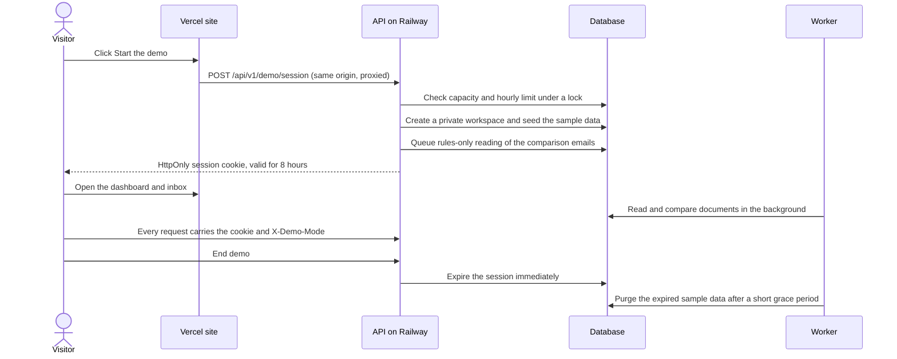
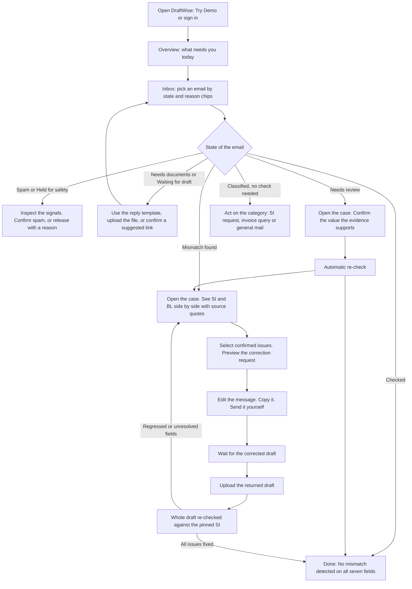
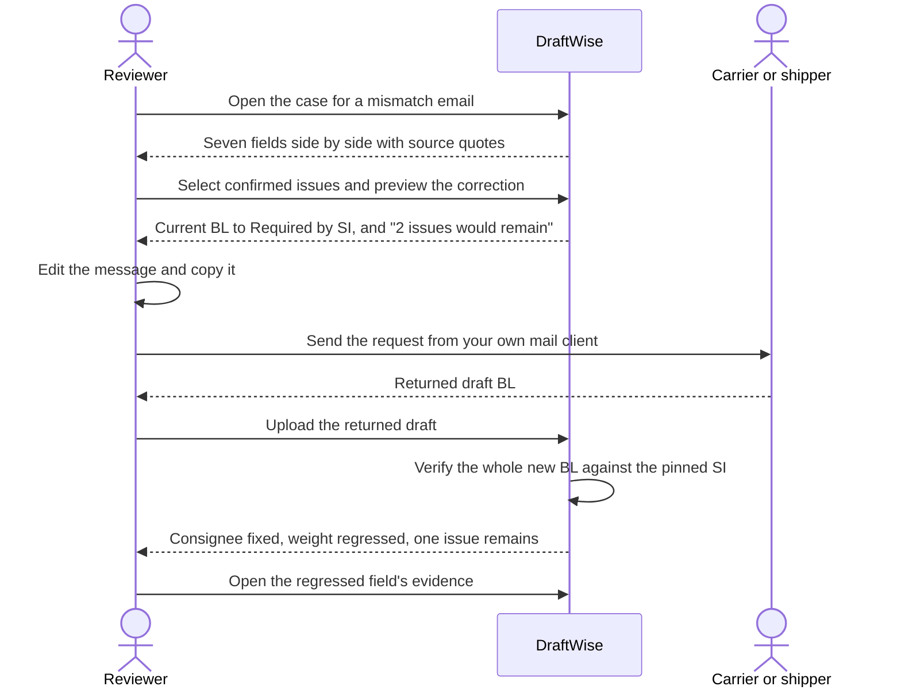
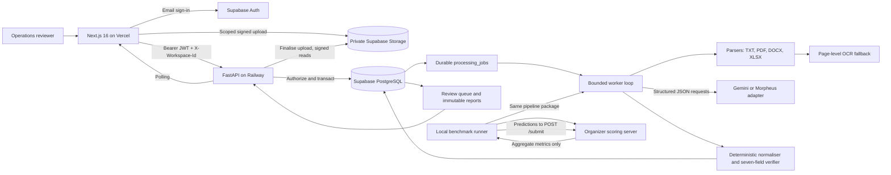
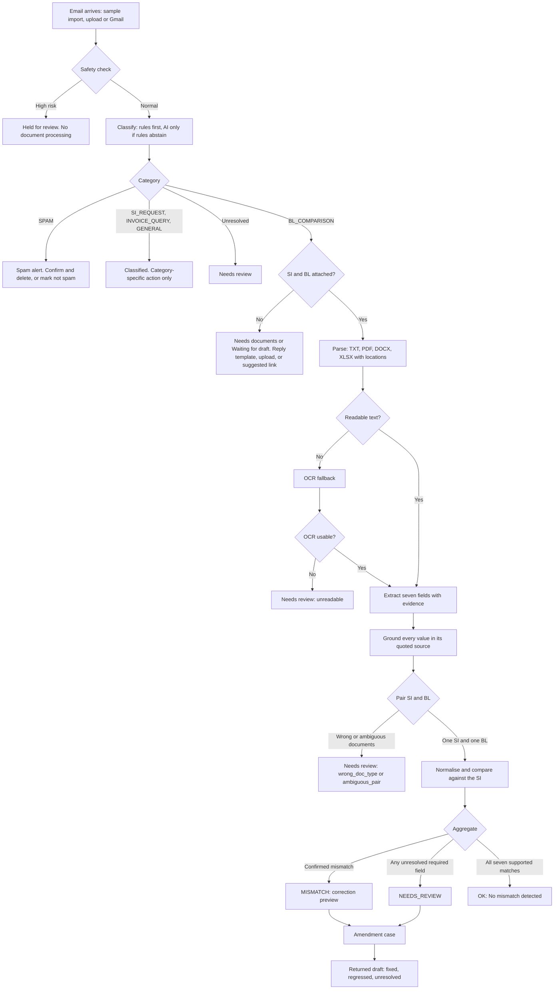
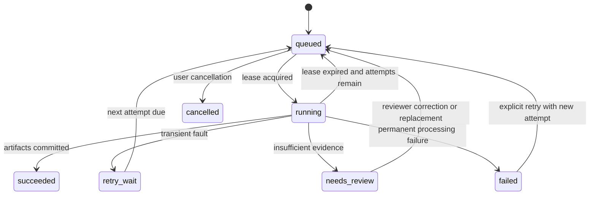

# DraftWise — Shipping Email & Document Verification Workspace

**🚀 Live deployment: [https://draft-wise-gold.vercel.app/](https://draft-wise-gold.vercel.app/)** — open the [no-sign-up demo](https://draft-wise-gold.vercel.app/demo) straight away.

**Event:** Averis x Monash Hackathon 2026  
**Team:** Commitment Issues  
**Track:** Shipping Document Verification (Shipping Instructions vs. draft Bill of Lading)  

<div align="center">
  
  <h3>Smart Email. Smoother Logistics.</h3>
  <p><em>Every draft checked. Every change explained.</em></p>
  <br/>
  <a href="https://draft-wise-gold.vercel.app/"><strong>🚀 Live Demo</strong></a>
  &nbsp;|&nbsp;
  <a href="#the-problem-and-how-we-tackle-it"><strong>🎯 Problem &amp; Approach</strong></a>
  &nbsp;|&nbsp;
  <a href="#why-choose-draftwise"><strong>💡 Why DraftWise</strong></a>
  &nbsp;|&nbsp;
  <a href="#ai-design-principles"><strong>⚙️ AI Design Principles</strong></a>
  &nbsp;|&nbsp;
  <a href="#run-on-localhost-quick-start"><strong>🛠 Run Locally</strong></a>
  &nbsp;|&nbsp;
  <a href="#system-architecture"><strong>🏗 Architecture</strong></a>
  &nbsp;|&nbsp;
  <a href="#api-reference"><strong>📡 API Reference</strong></a>
  <br/><br/>

  
  
  
  
  
  
  
  
  
</div>

---

## Overview

DraftWise is a full-stack, AI-assisted workspace for shipping operations teams. It reads a shipping inbox, works out which emails are asking for a document check, pulls the seven mandatory fields out of the **Shipping Instructions (SI)** and the **draft Bill of Lading (BL)**, compares them, and tells the reviewer exactly what to do next — with the source quote behind every value.

The core idea is that a reviewer should never have to hunt through attachments to find out *why* a draft was flagged, and should never be told a draft is clean when it has not really been checked. So DraftWise separates three things that most tools blur together:

- **What the documents say** — extracted values, each tied to an exact quote, page or cell in the original file.
- **Whether they agree** — a deterministic seven-field comparison against the SI, which is the authoritative reference.
- **What a person still has to decide** — anything unreadable, missing, ambiguous or unsupported becomes a visible review item, never a guessed answer.

On top of that check, DraftWise supports the full **amendment cycle**: preview exactly what to ask the carrier to change, ingest the returned draft, and explain what was fixed, what is still wrong, and whether a previously correct field has regressed.

The project was built by **Team Commitment Issues** for the **Averis x Monash Hackathon 2026**. The design goal is stated in the tagline: *every draft checked, every change explained.*

---

## Table of Contents

- [The Problem and How We Tackle It](#the-problem-and-how-we-tackle-it)
- [Why Choose DraftWise](#why-choose-draftwise)
- [Live Demo: How It Works and Its Limits](#live-demo-how-it-works-and-its-limits)
- [Run on Localhost (Quick Start)](#run-on-localhost-quick-start)
- [Live Deployment](#live-deployment)
- [Project Status](#project-status)
- [Hackathon Alignment](#hackathon-alignment)
  - [Problem statement coverage](#problem-statement-coverage)
  - [Judging criteria evidence](#judging-criteria-evidence)
- [AI Design Principles](#ai-design-principles)
  - [1. Rules first, AI when it earns its cost](#1-rules-first-ai-when-it-earns-its-cost)
  - [2. Every value is grounded in source evidence](#2-every-value-is-grounded-in-source-evidence)
  - [3. Guardrails on input and output](#3-guardrails-on-input-and-output)
  - [4. Never guess: uncertainty becomes review](#4-never-guess-uncertainty-becomes-review)
  - [5. Bounded, cached, budgeted AI calls](#5-bounded-cached-budgeted-ai-calls)
  - [6. Real, durable side-effects](#6-real-durable-side-effects)
- [Core Features](#core-features)
- [Signature Workflows](#signature-workflows)
- [User Workflow](#user-workflow)
- [System Architecture](#system-architecture)
- [Processing Pipeline](#processing-pipeline)
- [Verification Engine](#verification-engine)
- [Email Review States](#email-review-states)
- [Job State Machine](#job-state-machine)
- [Benchmark & Validation Results](#benchmark--validation-results)
- [Tech Stack](#tech-stack)
- [Project Structure](#project-structure)
- [Development & Testing](#development--testing)
- [Environment Variables](#environment-variables)
- [Deployment](#deployment)
- [API Reference](#api-reference)
- [Data and Storage](#data-and-storage)
- [Security & Safety](#security--safety)
- [Troubleshooting](#troubleshooting)
- [Known Limitations](#known-limitations)
- [Documentation Index](#documentation-index)
- [Verification Checklist](#verification-checklist)

---

## The Problem and How We Tackle It

### The problem statement

The hackathon brief, *"Shipping document verification: from email inbox to discrepancy report"*, describes a shipping operations team whose single inbox mixes very different messages: requests to check documents, requests to prepare new shipping instructions, invoice questions, operational updates — and spam.

For a **document-checking request**, the team compares two documents:

- the **Shipping Instruction (SI)** — the intended shipment details, and **the reference** for the check;
- the **draft Bill of Lading (BL)** — which must be checked **before it is finalised**.

The brief names three problems:

| # | Problem | Why it hurts |
|---|---|---|
| 1 | **Finding the right emails takes time.** Staff must read each message and decide what it needs. | A document request that is overlooked never reaches the checking step. |
| 2 | **Manual comparison is repetitive and easy to get wrong.** Names, ports, quantities and weights must be checked across two documents. | A missed discrepancy means corrections, delays and extra work. |
| 3 | **The same information can look different.** One document says "Port of Loading", the other "Load Port". | A system has to recognise these as the same field, or it raises false alarms. |

It asks for a system that, starting from the inbox, produces a clear result for every email and can:

| Capability | What it means |
|---|---|
| **Classify** | Tell comparison requests, new-SI requests, invoice queries, general messages and spam apart. Only comparison requests continue to checking. |
| **Extract** | For comparison requests, read the SI and BL attachments and find the matching shipment fields. |
| **Compare** | Check the values, surface mismatches and show the SI and BL values side by side. |
| **Ask for help** | When it cannot finish on its own, escalate to a person with the relevant context, rather than guessing or failing silently. |

**Exactly seven fields** are compared: shipper, consignee, notify party, port of loading, port of discharge, container count and gross weight in kilograms. If all seven agree the report says *"No mismatch detected"*. Its worked example: the SI lists 3 containers and 22,000 kg, the BL lists 4 containers and 22,000 kg — flag **only** the container count, showing SI: 3 / BL: 4.

The **advanced stage** raises the difficulty with more realistic data:

| Advanced challenge | What changes |
|---|---|
| PDF and Word attachments | Extract from tables and different page layouts, not just plain text. |
| Scanned documents | Image-only PDFs and scanned pages; use OCR, a vision model, or both. |
| Messier inputs | Varied labels, formatting differences, misleading subjects, missing attachments — and the system must tell a **real discrepancy** from a **reading or formatting issue**. |
| Reliability and human review | When a document is unreadable, a value is missing or the result is uncertain, send it for review with the evidence and reason, let a person confirm or correct it, update the report, and make failures visible and retryable. |

Success means finding the right requests and the right discrepancies **without false alarms**, and knowing when to ask a person.

### How DraftWise tackles it

| Problem | How DraftWise tackles it | See it in |
|---|---|---|
| **1. Finding the right emails takes time** | Every email is classified on arrival into the five categories, with rules first and AI only where rules abstain. Only comparison requests continue to checking; everything else gets a category-specific action. The inbox is **attention-first**: one state per email, plain-language reason chips and a recommended next action, so nothing that needs a person is buried. Suspicious mail is held before any processing. | [Email Review States](#email-review-states), [User Workflow](#user-workflow) |
| **2. Manual comparison is repetitive and error-prone** | DraftWise reads the SI and BL (TXT, PDF, Word, Excel, scans), extracts the seven fields **with the source quote for each**, and compares them deterministically: decimal-exact weights with unit conversion, container-count parsing, port codes, party identity. Mismatches appear side by side, and the SI is always the reference. | [Verification Engine](#verification-engine), [Processing Pipeline](#processing-pipeline) |
| **3. The same information looks different** | Label alias tables (`Consignor`, `Exporter`, `Loading Port`, `Qty of Containers`, `Gross Mass` …), bilingual labels, table layouts, `22 MT` ↔ `22,000 KG`, placeholder handling (`TBA` is *missing*, not a value), curated port aliases, and customer-scoped, human-approved equivalence rules. Formatting differences do not become false alarms. | [Verification Engine](#verification-engine) |
| **4. Ask for help instead of guessing** | Anything unreadable, missing, ambiguous or unsupported becomes `NEEDS_REVIEW` with a typed reason and the source evidence. A person confirms or corrects the value; that writes an immutable revision and recomputes the report. Failures are visible states with bounded, explicit retry — never a fabricated result. | [AI Design Principles](#ai-design-principles), [Job State Machine](#job-state-machine) |
| **5. Catch problems before the draft is finalised** | The **amendment loop**: preview exactly what to ask for, ingest the corrected draft, and see what was fixed and what **regressed**, against the same pinned SI. | [Signature Workflows](#signature-workflows) |

**The brief's own example is covered by unit tests.** Against an SI with 3 containers and 22,000 KG, a BL with 4 containers exports `container_count` as the only defect field, and a weight written as `22 MT` matches `22,000 KG` after exact unit conversion.

### What we cover, and what we added

- **All four required capabilities** — classify, extract, compare and ask for help — including the seven-field report and the *"No mismatch detected"* result, shown only when all seven fields are supported matches.
- **All four advanced challenges** — PDF and Word tables, scanned pages with OCR, messy inputs (varied labels, misleading subjects, missing attachments) and human review with visible, retryable failures.
- **Self-evaluation** — a reproducible offline runner that exports the agreed one-object-per-email submission and reads back the organizer's scoreboard. See [Benchmark & Validation Results](#benchmark--validation-results) for the score **and** its caveats.
- **Beyond the brief** — the amendment cycle with regression detection, correction previews, spam and phishing holds, drift monitoring, a page-aware assistant, approved equivalence rules, a customisable dashboard, a simulated Gmail fetch of the whole 520-email sample in the demo, and Gmail import for real mailboxes as clearly labelled future development.

---

## Why Choose DraftWise

> **The problem.** A draft Bill of Lading that disagrees with the Shipping Instructions on a single field — a container count, a consignee, a weight — can hold up a shipment or force an amendment. Checking by hand means opening two documents per email, hunting for seven values, and repeating the whole exercise when the carrier sends a revised draft. Fully automatic tools fail in the opposite way: they say *"looks fine"* when they have not really read the document.
>
> **DraftWise is built for that gap.** It does the reading and comparing, shows the evidence for every value, and says *"a person needs to look at this"* instead of guessing.

### Our selling points

| | Selling point | What it means for you | Proof in this repo |
|---|---|---|---|
| 🔎 | **Evidence on every value** | Click any extracted value and see the exact quote, page or cell it came from. No "trust me" numbers. | `ground_extraction` rejects any value whose quote is not in the cited block of that document. |
| 🛑 | **Never a false all-clear** | "No mismatch detected" appears only when all seven fields are supported matches. Missing, unreadable or ambiguous data becomes a visible review item. | Two missing values are never a match; an exhaustive invariant test guarantees nothing shows green unless a comparison actually passed. |
| 🔁 | **The whole amendment loop, not just a diff** | Preview exactly what to ask for, ingest the corrected draft, and see what was fixed, what is still wrong, and what **regressed**. | Regression detection (`fixed` / `unchanged` / `new` / `regressed` / `unresolved`) against one pinned SI; correction previews with a "what would remain" forecast. |
| 🎯 | **One question at a time** | The next-action card asks the single decision that unblocks the most checks, with the evidence already on screen and an honest *I cannot confirm* button. | Dependency-ordered action planner; dismissing a question never produces a clean result. |
| 💸 | **Predictable AI cost** | Rules do the work by default; AI runs only when rules abstain or you ask. The whole 520-email sample scores offline in under 7 seconds with zero provider calls. | `BoundedAI`: content-hash cache, per-workspace daily budget (`AI_DAILY_BUDGET`), back-off on rate limits, rules fallback. |
| 🧑‍⚖️ | **You stay in control** | Nothing is sent for you. Exports say *Copied*, never *Sent* or *Corrected*. A model cannot approve an alias or pick a disputed SI on your behalf. | Only a reviewer or admin can approve a scoped equivalence rule; rules never override numbers, countries or `ON BEHALF OF`. |
| 📄 | **Copes with messy reality** | TXT, PDF, Word tables, Excel, scanned pages (OCR), bilingual labels, `22 MT` vs `22,000 KG`, `TBA` placeholders, misleading subjects, quoted email history. | Parser suite, unit-conversion and label-alias tests, held-out documents in different layouts. |
| 🛡️ | **Safety built in** | Suspicious mail is held for review before any document is processed; drift is monitored against a *reviewed* baseline; every workspace is isolated. | Explainable safety signals, alerts with source links, Row Level Security with tenant-isolation tests. |
| 📊 | **Honest numbers** | We publish the organizer score **and** the weaker held-out result, with the caveats. You can reproduce both. | `scripts/benchmark.py` (offline by default) and the held-out evaluation; see [Benchmark & Validation Results](#benchmark--validation-results). |
| ⚡ | **Try it in seconds** | No account, no install: open the hosted demo and work through real sample emails in an isolated sandbox. Or run the whole stack on localhost. | Demo sandbox sessions; [localhost quick start](#run-on-localhost-quick-start). |
| ♿ | **Designed to be used** | Attention-first inbox, plain-language states with text chips (not colour alone), page-aware assistant, keyboard-accessible tooltips, mobile layouts. | axe accessibility checks in the Playwright suite; layouts verified at 390, 768 and 1440 px. |

### How we are different

The comparison below is against a generic *"an LLM reads two documents and summarises the differences"* tool, not against any named product.

| Question | A typical AI document checker | DraftWise |
|---|---|---|
| What does a check return? | A summary paragraph or a single match score | Exactly seven field decisions, each with SI value, BL value, normalisation applied and source quote |
| A value cannot be read | Guessed, or silently treated as equal | `missing` / `uncertain` → `NEEDS_REVIEW` with a typed reason; never a match |
| The carrier sends a revised draft | Start again from scratch | Old vs new against the *same pinned SI*: what was fixed, what regressed, what is unresolved |
| Asking for a correction | A hand-written or model-generated message | Patches built from validated source values, a forecast of what would remain, an editable message you copy and send yourself |
| Where AI sits | At every step | Rules first; AI only when needed, cached, budgeted and grounded in quotes |
| Learning from reviewers | Opaque retraining, or nothing | Explicit, customer-scoped, human-approved rules with an impact preview and one-click revocation |
| The inbox | A chronological list | Attention-first: one state per email, reason chips and a concrete next action |
| Reporting accuracy | One headline number | Sample score, held-out score and a written list of limitations |

### Choose DraftWise if you…

- **review draft BLs** and are tired of re-checking seven fields by eye every time a carrier revises the document;
- **cannot accept a false "all clear"** and would rather be asked than be wrong;
- want AI **without an unpredictable bill** or a black box you cannot audit;
- need to **show your working** — to a colleague, a customer or an auditor — with the source quote one click away;
- want to **try before committing**: the demo needs no sign-up, and the whole stack runs on localhost.

### What we deliberately do not claim

- We do **not** claim that no other product can compare shipping documents or draft amendment requests — comparison alone is not our claim. Our difference is the evidence-first amendment loop and how conservatively we treat uncertainty.
- We do **not** claim measured time savings. That the guided workflow reduces reviewer effort is a hypothesis we designed for, not a result we have measured.
- A **Checked** result covers the seven fields only. It is not legal, customs or cargo-release approval.

---

## Live Demo: How It Works and Its Limits

**Try it now: [draft-wise-gold.vercel.app/demo](https://draft-wise-gold.vercel.app/demo)** — click **Start the demo**. No account, no credit card.

You get an **isolated sample workspace** holding the 520 provided emails and 250 shipping documents. Everything you do stays in your own sandbox; other visitors cannot see or change it.

### What you can explore

| Feature | In the demo |
|---|---|
| Email classification (5 categories) | ✅ Working |
| Seven-field SI vs BL comparison with source evidence | ✅ Working |
| Human review queue and field correction | ✅ Working |
| Amendment cases, correction preview, returned-draft re-check | ✅ Working |
| Spam and phishing alerts, safety holds | ✅ Working |
| Concept drift monitoring | ✅ Working |
| Ask DraftWise assistant, customisable dashboard | ✅ Working |
| Trash, restore and delete | ✅ Working |
| Review with AI | ⚠️ Available, but limited to a small allowance (below) |
| Gmail | 🧪 **Simulated.** *Simulate Gmail fetch* fetches the whole supplied 520-email sample mailbox in one click (emails already in your workspace are reused, never duplicated); it does not connect to Google. Real Gmail is future development. |
| File uploads | ⚠️ Possible, but see the note on confidentiality below |

### How the demo works



1. **Start.** *Start the demo* calls `POST /api/v1/demo/session`. If your browser already holds a valid demo cookie, you are simply returned to the session you had.
2. **Guard rails.** Under a database lock (so concurrent visitors cannot slip past the caps), the server checks the [limits](#demo-limits) and refuses politely if they are reached.
3. **Your own sandbox.** It creates an anonymous user and a private workspace named *DraftWise demo*. You act as an **admin inside that workspace only**; the demo cannot reach any real workspace.
4. **Your own copy of the data.** It seeds all 520 emails and 250 attachment records, rule-based classifications for the emails the rules can decide (the rest stay unclassified until you ask for AI), email-safety assessments and their spam / phishing alerts, and an amendment case for each comparison email that has documents. The attachment *bytes* are not copied into Storage; they are read on demand from the sample bundle embedded in the backend.
5. **Background reading, rules only.** The worker reads and compares every comparison email's documents **without calling any AI provider**. The inbox appears immediately and fills in as the worker goes: rows marked *needs review — documents not read yet* turn into *Checked* or *Mismatch found*. Jobs are ordered so that nobody waits behind someone else: what you ask for with a button (such as **Review with AI**) goes first; then the first 12 emails of every session, in inbox order, so `email_001` and its neighbours are among the first to finish however many people have the demo open; then the rest of the mailbox, with the workers shared evenly between the sessions that are waiting. A progress banner on the Overview and Inbox shows how many emails have been read. **Measured on the hosted stack on 21 September 2026 (before the speed-ups below):** all 126 comparison emails were read and compared in about 8 minutes 50 seconds (241 jobs, roughly 0.45 jobs per second), with a developer's laptop worker helping. Each job is limited by database round trips, not by processing, so this update cut the round trips per email from about 75 to about 44 (measured locally, see [Project Status](#project-status)) and stopped starting a parser process for small text files; the new hosted time has to be re-measured after deployment.
6. **Your session cookie.** A random token is generated, only its **SHA-256 hash** is stored, and the browser receives it as an `HttpOnly` cookie named `draftwise_demo`, scoped to `/api/v1`, valid for 8 hours. Over HTTPS from another site it is `SameSite=None; Secure`; on local HTTP it stays `Lax`.
7. **Same-origin API calls.** In production the website forwards `/api/v1/*` to the Railway backend through its own domain, so the cookie is first-party. That keeps the demo working in Safari, Firefox strict mode and private windows, which block third-party cookies.
8. **Every request is checked.** Each call carries the cookie, the `X-Demo-Mode: true` header and your workspace ID; the server confirms the session is unexpired and that the workspace is yours.
9. **Ending.** **End demo** expires the session immediately and clears the cookie. Expired sample data is deleted automatically after a short grace period.

### Demo limits

| Limit | Value | Setting | What happens at the limit |
|---|---|---|---|
| **Session lifetime** | 8 hours | fixed | `401` *Demo session expired. Open the demo again.* — just start a new one. |
| **Demo sessions alive at once** | 60 | `DEMO_MAX_SESSIONS` (1 – 1000) | `429` *Demo capacity reached.* |
| **New demo sessions per hour** | 60, counted across **all** visitors | `DEMO_MAX_SESSIONS_PER_HOUR` (1 – 1000) | `429` *Demo creation limit reached. Try again in an hour.* |
| **Live AI calls per session** | 9 | `DEMO_AI_CALL_LIMIT` (0 – 30), `DEMO_AI_ENABLED` | *Demo AI allowance reached; using rules.* Everything keeps working on rules. |
| **AI by default** | Off — rules only until you click **Review with AI** | — | Each result is labelled AI, deterministic rules, or timeout fallback. |
| **Sessions per browser** | One — reopening the demo resumes it | — | — |
| **Data** | The fixed sample bundle | — | The demo cannot be pointed at your own mailbox. |
| **Production mode** | The demo refuses to run when `ENVIRONMENT=production` | `ENVIRONMENT`, `DEMO_ENABLED` | `404` *Local demo is not enabled.* The hosted demo runs in non-production mode by design. |

> **Good to know.**
> - Each session holds **its own copy** of the sample data, so the caps are a database-storage decision. Raise them only as far as your database allows.
> - A session keeps its slot until it expires or you click **End demo**, then frees it after a short grace period. Please end your demo when you are done.
> - The hourly cap is shared by everyone, not per person. If the demo is busy, try again later, or [run it on localhost](#run-on-localhost-quick-start).

### Clean-up and privacy

- **Automatic purge.** Expired sessions are purged (2-minute grace, in batches of up to 20) whenever a new session starts and by the background worker. This deletes the seeded emails, documents' derived data, cases, alerts, jobs and reports for that workspace.
- **What remains.** Anonymous session metadata and audit history are kept.
- **Uploads are the exception.** A session that uploaded its own file is **not** purged automatically, because uploaded bytes live in shared Storage and need administrator cleanup. Such a session keeps occupying one of the 60 slots until an administrator cleans it.
- **Do not upload confidential material into the demo.**
- The demo makes **no anonymous paid AI calls beyond the 9-call allowance**, and none at all unless you ask.

### A guided tour (about 5 minutes)

1. **Inbox → `email_001`.** Read the amendment request and choose **Open amendment case**.
2. **Check the pinned documents.** Once the email has been read, its case opens with the SI and draft BL already selected; use *Choose sources* to pick others.
3. **Inspect all seven fields** side by side with their source evidence, then **preview a correction**.
4. **Try a few other states.** Filter the inbox for *Mismatch found*, *Needs documents* and *Held for safety*, and open one of each.
5. **Alerts.** Inspect a spam or phishing signal and its source evidence.
6. **Analytics.** See the organizer-scorer result (1.000 on the 520-email sample, a sample-only result) and the AI classifier score on 60 held-out emails: rules alone 48 %, AI alone 95 %. Both are measured results that ship with the application, each labelled with its sample size.
7. **Ask DraftWise** (bottom-right): *"What needs my attention?"* — or, with an email open, *"What should I do here?"*
8. **End demo** when you are finished.

### Using your own account instead

Choose **Use my account instead** on the demo page (or open `/sign-in`), enter your email address and follow the one-time code or link Supabase sends. First sign-in creates a private admin workspace. There are no shared demo credentials, and the demo caps above do not apply — your workspace has its own daily AI budget (`AI_DAILY_BUDGET`, default 30).

### Running the demo yourself

Set `DEMO_ENABLED=true` (and keep `ENVIRONMENT` out of `production`), run the API **and the worker**, and open `/demo`. The sample bundle is embedded at `backend/data/sdoc-hackathon-bundle.zip`; set `DEMO_DATASET_PATH` only to use a different one. See the [Quick Start](#run-on-localhost-quick-start).

---

## Run on Localhost (Quick Start)

You will run **three processes** on your own machine. They share one hosted **Supabase** project (a free one is enough) for PostgreSQL, Auth and Storage.

| Process | What it does | Command | Address |
|---|---|---|---|
| **API** (FastAPI) | Serves the REST API | `uv run shipping-api` | http://localhost:8000 |
| **Worker** | Reads documents and runs checks in the background | `uv run python -m app.workers.runner` | none (no port) |
| **Frontend** (Next.js) | The website and the workspace | `pnpm dev` | http://localhost:3000 |

> ⚠️ **The worker is a separate process.** If you skip it the site still loads, but emails stay at *"documents not read yet"* because nothing is reading them. `/ready` returns `503` until a worker is running.

### Prerequisites

| Tool | Version | Notes |
|---|---|---|
| [uv](https://docs.astral.sh/uv/) | 0.8+ | Installs the right Python (3.11 – 3.13) for you |
| Node.js | 22+ | |
| pnpm | 10.15+ | `corepack enable` is the easiest way to get it |
| Supabase project | any | Free tier is fine |
| Git | any | |
| Tesseract OCR | optional | Only needed for scanned PDFs. On Windows set `TESSERACT_CMD` if it is not on `PATH` |
| AI key (Gemini or Morpheus) | optional | Not needed to try the app: rules run first, and AI is only used when you ask |

### Step 1 — Get the code

```bash
git clone https://github.com/TEE123754/DraftWise.git
cd DraftWise
```

> **Windows:** if the folder name contains `[` or `]` (for example `[!] Problem Statement`), PowerShell's `-Path` treats them as wildcards and some tools misbehave. Clone into a plain folder name such as `C:\dev\DraftWise`.

### Step 2 — Prepare Supabase (once)

1. Create a project at [supabase.com](https://supabase.com).
2. Open the **SQL editor** and run [`database/schema.sql`](database/schema.sql) on the fresh project. Then run every file in [`database/migrations/`](database/migrations/) **in filename order** (`002…`, `003…`, and so on). Do not run `amendment_workspace.sql`; it is already part of the schema.
3. **Storage → New bucket** named `shipping-originals`, **private**.
4. **Authentication → URL configuration:** add `http://localhost:3000/dashboard` as an allowed redirect URL.
5. Collect these values from the Supabase dashboard:

| Value | Where to find it |
|---|---|
| Project URL | Settings → API (e.g. `https://abcd1234.supabase.co`) |
| Service-role / secret key | Settings → API keys (**backend only**, never put it in the frontend) |
| Anon / publishable key | Settings → API keys (safe for the frontend) |
| Database connection string | Connect → **Session pooler** (use this if your network is IPv4-only) |

### Step 3 — Configure the backend

```bash
cp backend/.env.example backend/.env
```

```powershell
# Windows PowerShell
Copy-Item backend\.env.example backend\.env
```

Edit `backend/.env`. These are the **minimum** values:

```env
DATABASE_URL=postgresql://...            # your Supabase connection string
SUPABASE_URL=https://<project-ref>.supabase.co
SUPABASE_SERVICE_ROLE_KEY=<service-role or secret key>
SUPABASE_JWT_ISSUER=https://<project-ref>.supabase.co/auth/v1
ALLOWED_ORIGINS=http://localhost:3000
DEMO_ENABLED=true                        # enables the no-login demo
```

The demo seeds itself from the organizer's participant bundle (`inbox/` + `attachments/`; it contains no answer key), which is embedded at `backend/data/sdoc-hackathon-bundle.zip`. `DEMO_DATASET_PATH` is optional: when it is unset, or points at a file that does not exist, the backend falls back to that embedded bundle.

Leave the AI variables empty to run on rules only. Add `GEMINI_API_KEY` (or the Morpheus variables) later if you want the *Review with AI* button to work.

### Step 4 — Terminal 1: start the API

```bash
cd backend
uv sync --frozen
uv run shipping-api
```

You should see `Uvicorn running on http://127.0.0.1:8000`. Check it from another terminal:

```bash
curl http://localhost:8000/health
```

```json
{ "status": "ok", "version": "pipeline-v1" }
```

### Step 5 — Terminal 2: start the worker

```bash
cd backend
uv run python -m app.workers.runner
```

Leave it running. Now `curl http://localhost:8000/ready` returns `{"status":"ready","database":"ok","worker":"active","workers":{"hosted":0,"local":3,"unknown":0}}` (three job slots, all `local`).

### Step 6 — Terminal 3: start the frontend

```bash
cp frontend/.env.example frontend/.env.local
```

```powershell
# Windows PowerShell
Copy-Item frontend\.env.example frontend\.env.local
```

Edit `frontend/.env.local`:

```env
NEXT_PUBLIC_API_URL=http://localhost:8000
NEXT_PUBLIC_SUPABASE_URL=https://<project-ref>.supabase.co
NEXT_PUBLIC_SUPABASE_ANON_KEY=<anon or publishable key>
```

Then:

```bash
cd frontend
pnpm install --frozen-lockfile
pnpm dev
```

### Step 7 — Open it

| Address | What you should see |
|---|---|
| http://localhost:3000 | The DraftWise landing page |
| http://localhost:3000/demo | **Start the demo** — an isolated sample workspace, no account needed |
| http://localhost:3000/sign-in | Email sign-in (Supabase sends a one-time code or link) |
| http://localhost:8000/docs | Interactive OpenAPI documentation |
| http://localhost:8000/ready | `worker: "active"` once the worker is running |

**Your first 60 seconds:** open `/demo` → **Start the demo** → **Inbox**. The inbox appears straight away; the worker reads documents in the background, so rows marked *needs review — documents not read yet* turn into *Checked* or *Mismatch found* as it works (about 9 minutes for all 126 comparison emails against a remote database, measured once; the first page fills first). Open a **Mismatch found** email to see the seven fields side by side.

### Just want to see the engine, with no setup?

You can exercise the comparison logic without Supabase, keys or a browser:

```bash
cd backend
uv sync --frozen
uv run pytest tests/unit -q                    # 251 tests, no database needed
uv run shipping-verify --si path/to/instructions.txt --bl path/to/draft.txt --output report.json
```

Or run everything in containers (still uses your Supabase project): `docker compose -f docker/compose.dev.yml up --build` starts the API, the worker and the frontend together.

### If something does not work

| Symptom | Fix |
|---|---|
| Emails never leave *documents not read yet* | The worker is not running (Step 5). Check `/ready`. |
| The site cannot reach the API / CORS errors | `ALLOWED_ORIGINS` must contain the exact frontend origin. If port 3000 was busy and Next chose 3001, add `http://localhost:3001` and restart the API. |
| `uv run shipping-api` says the port is in use | Something is already on 8000. The launcher is fixed to `127.0.0.1:8000`; stop the other process. |
| `Failed to connect` to the database | Use the Supabase **Session pooler** string, and make sure the password has no unescaped special characters. |
| *Another `next dev` is already running* | Only one dev server per project folder is allowed. Use the address it prints, or stop the other one. |
| Sign-in link redirects to an error page | Add `http://localhost:3000/dashboard` to Supabase's allowed redirect URLs (Step 2). |

More in [Troubleshooting](#troubleshooting).

---

## Live Deployment

| Service | Platform | URL | Purpose |
|---|---|---|---|
| Frontend | Vercel | [https://draft-wise-gold.vercel.app](https://draft-wise-gold.vercel.app/) | Next.js App Router site: public landing pages, no-login demo and the signed-in workspace. |
| Backend API | Railway | [https://draftwise-production.up.railway.app](https://draftwise-production.up.railway.app/health) | FastAPI service built from `docker/backend.Dockerfile` via the root `railway.json`. The background worker is a separate process from the same image (see [Deployment](#deployment)). |
| Database, Auth, Storage | Supabase | Project-specific | PostgreSQL (schema in `database/`), email sign-in, and a private `shipping-originals` bucket. |

| Link | URL |
|---|---|
| **Live app** | [https://draft-wise-gold.vercel.app/](https://draft-wise-gold.vercel.app/) |
| **No-sign-up demo** | [https://draft-wise-gold.vercel.app/demo](https://draft-wise-gold.vercel.app/demo) |
| **API health** | [https://draftwise-production.up.railway.app/health](https://draftwise-production.up.railway.app/health) |
| **Source code** | [github.com/TEE123754/DraftWise](https://github.com/TEE123754/DraftWise) |

The frontend is deployed with **Vercel root directory `frontend/`**. The backend is deployed on Railway from the repository root, where `railway.json` selects the Dockerfile and points the health check at `/health`. The step-by-step guide is in [docs/DEPLOYMENT_GUIDE.md](docs/DEPLOYMENT_GUIDE.md).

```env
# Production frontend variable (Vercel) - set it before the build
NEXT_PUBLIC_API_URL=https://draftwise-production.up.railway.app
```

**Same-origin API.** Because `NEXT_PUBLIC_API_URL` is an `https://` URL, `frontend/next.config.ts` rewrites `/api/v1/*` to the Railway backend and the browser only ever calls its own origin (`https://draft-wise-gold.vercel.app/api/v1/…`). That keeps the demo session cookie first-party, so the demo works in Safari, Firefox strict mode and private windows. The choice is made at **build time**, so redeploy Vercel after changing the variable. With an `http://` URL (local development) the browser calls the backend directly.

---

## Project Status

*Last verified on 21 September 2026. The checks below were run on the working tree that became this update; the hosted figures marked *before this update* were measured on the deployed site earlier that day.*

### What is live

| Component | State |
|---|---|
| **Frontend** | Deployed on Vercel at [draft-wise-gold.vercel.app](https://draft-wise-gold.vercel.app/): the "Version B" glass-style redesign, public pages (`/`, `/workflow`, `/pricing`, `/privacy`, `/terms`), the demo and the signed-in workspace. It forwards `/api/v1/*` to the backend through its own origin. |
| **API** | Deployed on Railway at [draftwise-production.up.railway.app](https://draftwise-production.up.railway.app/health). `/health` returns `ok`. The image now runs the API **and** a supervised worker in one container. Before this update the hosted worker was a process on a developer machine sharing the database, so the hosted demo only worked while that machine was on; `/ready` could not tell the difference. |
| **Database, Auth, Storage** | Supabase: 33 tables with Row Level Security, numbered migrations through `017` (`017` must be applied before deploying this update, see [Deployment](#deployment)), a private `shipping-originals` bucket, email one-time-code sign-in. |
| **Demo** | Enabled, running in non-production mode. Limits: 60 live sessions, 60 new sessions per hour, 8-hour sessions, 9 AI calls per session. See [Live Demo: How It Works and Its Limits](#live-demo-how-it-works-and-its-limits). |
| **AI** | Gemini or Morpheus, chosen by `AI_PROVIDER`. Off by default: rules run first, and AI is cached and budgeted. |

### Checks run for this update

| Check | Result |
|---|---|
| Backend unit tests | **251 passed** |
| Backend PostgreSQL integration tests (isolated local database) | **77 passed** — 328 in the full backend suite, in about 80 seconds |
| Browser tests (Playwright, including axe accessibility checks) | **55 passed** |
| TypeScript type check · ruff lint | clean · clean |
| Repository validator (spec artifacts, schema examples, SQL inventory) | pass |
| **Organizer scorer**, 520-email sample, offline (`ai_fallback: false`) | **1.000** — 46 / 46 defects with exact fields, 20 / 20 review cases escalated, 520 emails in 4.4 seconds (re-run after the parser and queue changes below; `organizer-eval-06`) |
| Independent 60-email held-out set | Rules only **48 %** (abstains rather than guessing) · with live AI **95 %** *(last measured earlier; no classification, extraction or comparison code has changed since. Plain-text parsing now runs in-process; its output is unchanged and covered by the organizer re-run above)* |
| GitHub Actions, backend job | Was failing on every push until 21 September because of a Linux-only pytest hook error; fixed, and green on the two pushes since (`891cd54`, `57d1642`). This update's own run appears on the repository after the push. |
| Database round trips per email (measured locally by counting statements and transactions) | About **44**, down from about **75**: claim 3, read 19 (was 34), compare 19 (was 35), plus 3 to claim it. Each round trip to the hosted database costs 100 to 350 ms, so this is where the reading time goes. |
| Hosted demo, fresh session, before this update | All 126 comparison emails read and compared in about **8 min 50 s**; end state 46 mismatches, 63 checked, 8 needing review, 2 unreadable documents; the first tour email was *Checked* within seconds; *Review with AI* completed in under a minute. |

The 1.000 is a **sample-only** result; read it together with the held-out row and the [Known Limitations](#known-limitations). The organizer scorer was re-run offline after the parser and queue changes of this update and again scored 1.000; the database round-trip changes are covered by the full backend suite. The hosted journey was walked through by hand (start the demo, read the mailbox, open a mismatch, use *Review with AI*, end the demo); there is no automated hosted smoke test yet.

### What changed most recently

| Commit | Change |
|---|---|
| [`259b5dc`](https://github.com/TEE123754/DraftWise/commit/259b5dc) | Complete UI overhaul ("Version B" glass-style design) and a stricter `.gitignore` |
| [`15dcc94`](https://github.com/TEE123754/DraftWise/commit/15dcc94) · [`6dd2906`](https://github.com/TEE123754/DraftWise/commit/6dd2906) · [`2e0c88d`](https://github.com/TEE123754/DraftWise/commit/2e0c88d) | Root `railway.json` for Docker deploys, the Vercel + Railway deployment guide, and a fix that made the site-URL resolution safe for Vercel builds |
| [`8367cea`](https://github.com/TEE123754/DraftWise/commit/8367cea) | Sample bundle embedded in the backend so cloud demo sessions can seed themselves |
| [`abc3357`](https://github.com/TEE123754/DraftWise/commit/abc3357) | Demo cookie issued as `SameSite=None; Secure` for an HTTPS site calling another HTTPS site |
| [`4613e16`](https://github.com/TEE123754/DraftWise/commit/4613e16) | `/api/v1` proxied through the Vercel origin so the demo cookie is first-party (Safari, Firefox strict mode, private windows) |
| [`e3671b0`](https://github.com/TEE123754/DraftWise/commit/e3671b0) | Demo caps made configurable and raised from a hard-coded 20 to 60 |
| [`e9391ad`](https://github.com/TEE123754/DraftWise/commit/e9391ad) · [`69fe0b0`](https://github.com/TEE123754/DraftWise/commit/69fe0b0) · [`891cd54`](https://github.com/TEE123754/DraftWise/commit/891cd54) · [`57d1642`](https://github.com/TEE123754/DraftWise/commit/57d1642) | Linux CI fix; the deployed image now runs its own worker; small text files parsed in-process; reading-progress banner; AI step in the guided tour; [impact and rollout plan](docs/IMPACT_AND_ROLLOUT.md) |
| *This update* | **Analytics** shows the measured results on the hosted site (organizer scoreboard and 60-email held-out score ship in `backend/data`; the saved score appears without a click). **Speed and fairness:** about 40 % fewer database round trips per email; jobs carry a priority (what you ask for, then each session's first 12 emails, then the rest) and workers are shared evenly between sessions instead of newest-first. **`/ready` tells hosted workers from laptop ones** (migration `017`). **Gmail:** real users get a clear future-development message and no fake sync; the demo fetches all 520 sample emails in one click. |

### Still open

Gmail import for real mailboxes (future development), a fresh held-out evaluation, a live AI provider quality run, per-visitor (rather than global) demo rate limits, an automated hosted smoke test, a many-visitor load test of the queue, the hosted re-measurement of the reading time, and the time-to-decision report and pilot described in [docs/IMPACT_AND_ROLLOUT.md](docs/IMPACT_AND_ROLLOUT.md). Details are in [Known Limitations](#known-limitations).

---

## Hackathon Alignment

### Problem statement coverage

*The problem statement itself, and our approach to it, are summarised in [The Problem and How We Tackle It](#the-problem-and-how-we-tackle-it).*

The use case asks for a system that starts from an inbox, decides which emails need action, reads the attached SI and BL, compares seven fields, and escalates anything it cannot resolve. The table below maps each requirement to what DraftWise does.

| Requirement from the use case | How DraftWise addresses it |
|---|---|
| Start from an inbox and give a clear result for every email | Every email gets a server-computed review state (spam, held, needs documents, waiting for draft, needs review, mismatch found, checked, classified) with text reason chips, not colour alone. |
| Classify each email as comparison request, new SI request, invoice query, general or spam | Five-class classifier (`BL_COMPARISON`, `SI_REQUEST`, `INVOICE_QUERY`, `GENERAL`, `SPAM`). Rules run first; the AI classifier handles what rules abstain on. Current intent wins over quoted history and misleading subjects. |
| Only comparison requests continue to document checking | Non-comparison mail is classified only; it never launches SI/BL verification. Ambiguous intent escalates to a person. |
| Read the corresponding SI and BL attachments; the SI is the reference | Document role is recognised from content, not the filename. Pairing inside an email is explicit; ambiguity (two SIs, two BLs) escalates instead of guessing. |
| Recognise equivalent labels (Port of Loading / Load Port …) | Label alias tables cover synonyms, bilingual labels and layout variants (`Consignor`, `Exporter`, `Loading Port`, `Qty of Containers`, `Gross Mass`, `G.W.` …), with tests. |
| Compare exactly seven fields | `shipper`, `consignee`, `notify_party`, `port_of_loading`, `port_of_discharge`, `container_count`, `gross_weight_kg` — always exactly seven decisions per report. |
| Show the checked email, the mismatch and side-by-side values | Case workspace shows SI and BL values side by side with the exact source evidence, the normalisation applied, and the pinned SI/BL versions. |
| All seven match → "No mismatch detected" | Shown only when all seven fields are supported matches. Missing values, failed reads and preview-only changes never clear a case. |
| SI says 3 containers, BL says 4, weight equal → flag only container count | Covered by a named acceptance test; `22,000 KG` vs `22 MT` matches after exact unit conversion. |
| PDF and Word tables, varied layouts | pdfplumber / pypdf / pypdfium2 for PDF, python-docx for Word (including table cells), openpyxl for Excel, plain text — each keeps page, cell and table locations. |
| Scanned / image-only pages | Page-level OCR fallback (Tesseract) with quality gates; unreadable pages become review cases with a typed reason. |
| Messy formatting, misleading subjects, missing attachments; separate a real mismatch from a read failure | `MISMATCH`, `NEEDS_REVIEW` and processing failure are different states. A missing attachment is a review reason, never a guessed value. |
| Ask a person, with evidence and a reason; allow correction | Field review form with source location; a correction writes an immutable revision, recomputes dependent fields and the report, and invalidates stale previews. |
| Fail visibly and allow retries | Durable job queue with leases, bounded retry with backoff, and an explicit retry endpoint. A provider outage is `retry_wait` / `failed`, never a fabricated result. |
| JSON inbox + referenced attachments; optional scored evaluation | Dataset adapters (folder, ZIP, Docker HTTP) with path-traversal and archive-bomb guards, and a benchmark runner that exports a schema-valid submission for every email ID. |

### Judging criteria evidence

| Criterion | Where to look |
|---|---|
| **End-to-end functionality** | Live demo: open a sample email → documents linked → seven-field comparison → correction preview → returned draft analysis. Backed by an API + worker + database journey test. |
| **Architecture & scalability** | Typed service boundaries, durable `processing_jobs` with `SKIP LOCKED` leasing and fencing, tenant isolation with Row Level Security. See [System Architecture](#system-architecture). |
| **Technology integration** | Next.js ↔ FastAPI ↔ Supabase (Auth, Storage, PostgreSQL) ↔ Gemini / Morpheus, plus Tesseract OCR, all connected and deployed. |
| **Engineering quality & robustness** | 251 backend unit tests, 77 PostgreSQL integration tests, 55 Playwright browser tests with axe accessibility checks, ruff, and a CI workflow on every push (see the Project Status note on the Linux fix). See [Benchmark & Validation Results](#benchmark--validation-results). |
| **Solution effectiveness & value** | The amendment cycle: regression detection, exact-scope correction previews, one-question-at-a-time next actions. See [Signature Workflows](#signature-workflows). |
| **User experience & differentiation** | Attention-first inbox, evidence viewer, explainable states, page-aware assistant, keyboard-accessible tooltips, mobile layouts verified at 390 / 768 / 1440 px. |
| **Impact & future potential** | [docs/IMPACT_AND_ROLLOUT.md](docs/IMPACT_AND_ROLLOUT.md): eight success measures with definitions, data sources and pilot targets (targets, not results), a shadow-mode then assisted-mode rollout with go / no-go gates, and risks. Plus approved equivalence memory (scoped per customer), drift monitoring against a reviewed baseline, Gmail connection and workspace-level AI budgets. |

---

## AI Design Principles

### Where AI is used, and what it adds

| Stage | What the model does | What decides when it is unavailable | Measured effect |
|---|---|---|---|
| **Classify** an email into five categories | Reads the current message and decides when the rules abstain (misleading subject, unusual wording) | The email stays *unclassified* and goes to a person | Held-out set of 60 emails: rules alone 48 % (0 confidently wrong), rules plus AI **95 %** |
| **Extract** the seven fields | Reads fields the labelled-text rules could not find, in layouts the rules do not know | The field is `missing` and the case goes to review | Held-out: 21 / 21 fields on 3 unseen documents with AI |
| **Route** an assistant question | Maps a free-text question to one of a fixed set of read-only answers; it cannot write facts or invent citations | Common questions still match by keyword; the rest are answered *unsupported* | Not benchmarked |

So the model is what lets DraftWise handle wording and layouts it has never seen; the rules, the evidence check and the person decide what is true. In the hosted demo AI is off until you choose **Review with AI** (9 calls per session), so try that on a few emails to see it: each result is labelled AI, rules or timeout fallback.

DraftWise uses an LLM, but it does not let the LLM be the authority on anything that matters. These are the six principles the system is built around, each traceable to code.

### 1. Rules first, AI when it earns its cost

Classification, parsing, extraction, comparison and reference matching all run on deterministic rules first. AI is called only when:

1. the rules **abstain** on an email's category,
2. a document has **three or more fields** the labelled-text extractor could not read, or
3. the user explicitly clicks **Review with AI**.

Batch processing and demo seeding run with AI **off**. The offline benchmark records `ai_fallback: false` in its manifest so a score can never silently include paid calls.

### 2. Every value is grounded in source evidence

An extraction is not accepted just because it is valid JSON. `ground_extraction` (`backend/app/ai/grounding.py`) rejects any field unless:

- its evidence points at a block in **that** document (evidence cannot cite another attachment),
- the quoted text actually appears in the cited block, and
- the extracted value is contained in its own quote.

Duplicate JSON keys and non-finite numbers in a provider response are rejected outright. Values that cannot be traced to a quote are dropped or sent to review.

### 3. Guardrails on input and output

**Input**

- Emails and attachments are treated as **untrusted data**, including any text that looks like an instruction to the AI. Model clients are given no tools, no secrets and no database access.
- Upload validation checks that signature, MIME type and extension agree; enforces size (20 MB) and PDF page (20) limits; and inspects OOXML ZIP entry counts and expansion ratios before parsing.
- Email safety signals (`email_safety.py`) are static and explainable. No link is fetched and no HTML is executed. High-risk mail is **held for human review before any document processing**.

**Output**

- Provider responses are parsed into strict Pydantic models. Anything that does not conform becomes a visible retry or review state, not a silent fallback.
- Explanations are deterministic templates, e.g. `Container count differs: SI 3; BL 4. Both values are explicitly labelled.`
- Correction messages are filled from validated source values; numbers, parties and ports are never generated from model memory.

### 4. Never guess: uncertainty becomes review

- If either side of a field is unresolved, the result is `missing` / `uncertain`. **Two missing values are not a match.**
- Any unresolved required field → `NEEDS_REVIEW`. Otherwise any confirmed mismatch → `MISMATCH`. Otherwise `OK`.
- A bare `22` is never assumed to be kilograms — it could be tonnes — and stays a review item.
- Fuzzy party-name similarity produces a *candidate*, not an approval. `ABC Trading` and `ABC Trading Indonesia` can score deceptively high, so token-subset similarity alone never approves.
- An LLM's "these are equivalent" cannot approve an unregistered alias. Only a human-approved, scope-limited rule can.
- `Checked` means the scoped seven-field comparison is complete. It does **not** mean the shipment is approved for release, and no screen implies legal, customs or cargo-release compliance.

### 5. Bounded, cached, budgeted AI calls

Every live AI call goes through `BoundedAI` (`backend/app/services/bounded_ai.py`):

- **Cached** by content hash — an identical input is never sent twice.
- **Counted** against a per-workspace daily budget (`AI_DAILY_BUDGET`, default 30); demo sessions get a smaller allowance.
- **Paced and retried** with backoff on provider rate limits.
- Past a limit, the caller falls back to rules. The UI shows *AI calls used: n / budget*.

### 6. Real, durable side-effects

Nothing stops at a text summary. Each stage writes its output and enqueues the next job in one transaction.

| Action | Real-world effect |
|---|---|
| Email imported or uploaded | Row in `emails`; attachment reserved under a UUID key in private Supabase Storage; upload finalised only after byte count, hash and MIME signature are verified. |
| Document read | Immutable `source_blocks` and `document_extractions` rows, keyed by content hash and parser / model / prompt versions. |
| Comparison run | Immutable `verification_reports` with seven `comparisons` and `discrepancies`; report inputs pin exact extraction revisions. |
| Reviewer corrects a field | New immutable revision with actor, evidence and reason; dependent fields and the report recompute; stale previews are invalidated. |
| Returned draft uploaded | New amendment round; old and new results classified `fixed` / `unchanged` / `new` / `regressed` / `unresolved` against the same pinned SI. |
| Suspicious email | Safety hold, alert with source signals; release / relabel / confirm-spam actions are audited. |
| Email deleted | Soft delete to Trash (30-day retention), then a purge that also queues physical Storage deletion with retry and growing back-off. |
| Gmail connected | OAuth grant stored with tokens encrypted at rest; disconnect revokes the grant with Google and erases both tokens. |

---

## Core Features

| Feature | Description |
|---|---|
| Attention-first inbox | Every email carries a computed state, reason chips (`missing_si`, `awaiting_draft`, `wrong_doc_type`, `mismatch:<fields>` …), stable display IDs (`email_007`) and a concrete next action. |
| Five-class email classification | Rules + AI classifier with quoted-history separation, negation and misleading-subject handling, and a bounded shipping-domain sense layer (SI, BL, POL, POD …). |
| Multi-format document reading | TXT, PDF, DOCX and XLSX with page / cell / table locations; OCR for scanned and hybrid pages; hidden rows, columns and formulas handled explicitly. |
| Seven-field verifier | Decimal-exact weights and unit conversion, container-count parsing (`2x20GP + 1x40HC`), UN/LOCODE-backed port aliases, party identity comparison that preserves qualifiers like `ON BEHALF OF`. |
| Evidence viewer | Every extracted value links back to its exact source quote and location. |
| Amendment cases | A case pins the SI, BL and policy versions and tracks issues across rounds. |
| Regression detection | Old-vs-new comparison flags a field that was correct and now differs. |
| Correction preview | Select confirmed issues → see *Current BL → Required by SI* and the forecast of remaining issues → copy an editable request. Nothing is sent automatically. |
| Guided next action | One question at a time (*Which SI applies?*), ordered by dependency and number of unblocked checks, with an explicit *I cannot confirm* path. |
| Approved equivalence rules | Field-specific, customer-scoped aliases with impact preview, supervisor approval and revocation. Numeric values, countries and identity qualifiers can never be overridden. |
| Missing-document actions | Local reply templates and reference-code suggestions ("suggested link", never auto-link) for emails that lack an SI or BL. |
| Spam & phishing review | Explainable signals, safety holds, alert investigation with source links, release / relabel / confirm-spam actions. |
| Drift monitoring | Compares two disjoint windows against a *reviewed* baseline; shows "insufficient data" instead of inventing one. |
| Page-aware assistant | Floating chat that knows which email or case is open, answers from authorised workspace data with citations, and uses rules before any AI. |
| Customisable dashboard | Toggle and reorder panels, saved per workspace; every count drills down. |
| Trash & retention | 30-day restorable Trash, retention purges, and durable Storage cleanup. |
| No-login demo | Isolated, 8-hour sandbox workspace seeded from the supplied sample data, with capped capacity and a small AI allowance. See [Live Demo: How It Works and Its Limits](#live-demo-how-it-works-and-its-limits). |
| Gmail | In the demo, **Simulate Gmail fetch** fetches the whole 520-email sample mailbox. For real users Gmail fetching is **future development**: connecting and syncing answer with a clear message instead of pretending (Google sign-in and encrypted token storage are built and switched off). |
| Analytics | Organizer-scorer results, AI classifier accuracy panel, and AI usage against budget. |
| Benchmark harness | Reproducible offline runner, schema-validated submission export, aggregate-only scoring. |

---

## Signature Workflows

### 1. Amendment cycle with regression detection

A corrected BL can fix one issue while changing a field that was previously right. Re-checking every version by eye is slow and error-prone.

When a returned draft is uploaded, DraftWise verifies the **entire** new BL against the pinned SI, then compares old and new results field by field:

| Change | Meaning |
|---|---|
| `fixed` | Was wrong, now matches the SI |
| `unchanged` | Same result as before |
| `new` | Newly appeared issue |
| `regressed` | Matched the SI before, differs now |
| `unresolved` | Still cannot be decided |

Example summary: *"Consignee fixed; gross weight changed; one issue remains."* An unreadable replacement can never inherit the old value or mark an issue fixed, and a changed SI creates a new baseline instead of silently closing issues against the old one.

### 2. Correction preview with exact scope

Select confirmed issues and DraftWise generates deterministic patches (*Current BL → Required by SI*), applies them to a transient copy of the normalised BL fields, and re-runs the same verifier to forecast what would remain — for example, *"If these changes are made, 2 issues would remain."*

- The preview is a forecast, not proof the carrier changed anything.
- Missing or disputed reference values can never become requested replacements.
- The original selection, preview hash and edited message are persisted; using a stale preview returns `409`.
- Export says **Copied**, never *Sent* or *Corrected*.

### 3. One question that resolves several blockers

Dependencies are explicit: pairing precedes comparison; a required value depends on its source region; a notify-party reference may depend on the same document's consignee. The next-action card shows the smallest useful decision, why it matters, and the evidence already on screen. A model cannot decide a disputed authoritative SI on the operator's behalf, and a dismissed question never produces a clean result.

### 4. Approved equivalence memory

After confirming a supported alias, a reviewer can propose it as a rule. A supervisor sees the exact field / customer scope, the evidence and an affected-case preview before approval. An approved alias for Customer A never applies to Customer B, and revoking a rule marks affected reports stale for re-verification without rewriting them.

---

## User Workflow

DraftWise is organised around one question: **"What should I do next?"** Every screen answers it for the person using it.

### Who uses it

| Role | Typical person | What they can do |
|---|---|---|
| **Viewer** | Manager, auditor | Read the dashboard, inbox, cases and analytics. Cannot change anything. |
| **Operator** | Documentation clerk | Add emails and documents, run checks, retry jobs, open cases and upload returned drafts. |
| **Reviewer** *(primary user)* | Shipping operations reviewer | Everything an operator can, plus confirm which SI and BL apply, correct a field against its evidence, prepare correction requests, release safety holds, resolve alerts, and approve or revoke equivalence rules. |
| **Admin** | Team lead, workspace owner | Everything a reviewer can, plus budgeted AI classifier evaluations and storage clean-up. |

Signing in creates a private workspace with the admin role. Demo sessions get an isolated sandbox.

### The end-to-end journey



### Step by step

| # | You | DraftWise | Where |
|---|---|---|---|
| 1 | **Start.** Click **Try Demo**, or sign in with your email address. | Creates an isolated sandbox, or your private workspace on first sign-in. | `/demo`, `/sign-in` |
| 2 | **See what needs you.** Open the overview. | Counts by state, the work that needs a person today, and processing progress. Panels are customisable. | `/dashboard` |
| 3 | **Pick an email.** Filter the inbox by state or category, or search. | One state per email, text reason chips (`missing_si`, `mismatch:container_count` …) and the recommended action. | `/inbox` |
| 4 | **Understand it.** Open the email. | Shows the six-step review workflow (below), safety signals, attached documents and their roles. | `/inbox/[id]` |
| 5 | **Run the check.** Click **Review with local rules** (default) or **Review with AI**. | Reads and extracts the documents, grounds each value in its quote, compares against the SI. AI is used only when you ask or rules abstain. | same page |
| 6 | **Open the case.** Confirm which SI and BL apply. | Pins the SI, BL and policy versions and opens the amendment case. | `/cases/[id]` |
| 7 | **Resolve uncertainty.** Answer the next-action card, or correct a field against its evidence. | One question at a time, ordered by what unblocks most checks. A correction writes an immutable revision and recomputes the report. | case page |
| 8 | **Ask for the fix.** Select confirmed issues and click **Preview correction request**. | Shows *Current BL → Required by SI* per field and forecasts what would remain. Nothing changes yet. | case page |
| 9 | **Send it.** Edit the message, then **Copy**. | Records what you copied. It does not send email; you send it from your own mail client. | case page |
| 10 | **Receive the corrected draft.** Upload it to the case. | Verifies the *entire* new BL against the same pinned SI, then reports fixed, regressed and unresolved fields. | case page |
| 11 | **Close it out.** | When all seven fields are supported matches the case shows **Checked** and moves to Completed. | `/completed` |
| 12 | **Housekeeping.** | Alerts (spam, phishing, drift), Rules (approved equivalences), Analytics (accuracy), Trash (30-day restore), connections. | `/alerts`, `/rules`, `/analytics`, `/trash`, `/settings/connections` |

At any point, the **assistant** (bottom-right) can answer *"what needs my attention?"* or, while an email or case is open, *"what should I do here?"* — from your workspace's own data, citing cases.

### The six-step review workflow on every email

Each email page walks the same six steps, so you always know how far it got and what is blocking it:

| Step | Shows |
|---|---|
| **1. Intake** | Email received; attachments linked to this request |
| **2. Classify** | Category (`BL COMPARISON`, `SI REQUEST`, `INVOICE QUERY`, `GENERAL`, `SPAM`), or *Intent needs review* |
| **3. Documents** | `SI: found / missing. BL: found / missing.` |
| **4. Extract** | Processing, or how many documents were read and which fields are missing or uncertain |
| **5. Compare** | *All seven required fields match*, *Differences require review*, *Not required for this email category*, or *Comparison is incomplete* |
| **6. Decide / Reply** | The single recommended next action, or *Review the safety hold before processing* |

### The amendment loop



### Four short scenarios

**1. Everything matches**
- *You see:* a green **Checked** email; the case shows seven matches.
- *You do:* nothing. Note that `22,000 KG` on one document and `22 MT` on the other is a match, not a weight discrepancy.

**2. The container count differs**
- *You see:* **Mismatch found** with reason chip `mismatch:container_count`; the SI says 3 and the BL says 4; the other six fields match.
- *You do:* preview the correction, copy the request, send it, upload the returned draft. DraftWise confirms the count is fixed and that no other field changed.

**3. The draft never arrived**
- *You see:* **Needs documents** (attachments claimed but absent) or **Waiting for draft** (the sender was asked to send it), with a reason chip such as `missing_bl`.
- *You do:* use the reply template to ask the sender, upload the file yourself, or confirm a suggested link to a document in another email. DraftWise never invents a value for the missing document, and only suggests links on an **exact** reference match.

**4. A suspicious email**
- *You see:* **Held for safety** in red, with the explainable signals (for example a request for account credentials combined with urgency or a link, or an executable attachment).
- *You do:* inspect the signals and either confirm spam (it moves to Trash, restorable for 30 days) or release it with a written reason. No document in a held email is processed until you release it.

### Supervisor workflow: teaching DraftWise a safe alias

1. While reviewing a case you confirm that two spellings really are the same (say, a port or company name).
2. You propose an equivalence rule for that field and that customer.
3. A reviewer or admin sees the exact scope, the evidence and a preview of which past cases it would touch, then approves it.
4. Future matches for **that customer only** show an *Approved rule* badge.
5. Revoking the rule marks affected reports as needing a re-check. Original reports are never rewritten.

Numbers, countries and identity qualifiers such as `ON BEHALF OF` can never be equated by a rule.

---

## System Architecture



**Deployment baseline:** the **API** (Uvicorn) and the **worker** are two separate processes built from the same image. The API validates requests and enqueues work; the worker claims jobs from PostgreSQL and runs the parsers, OCR, AI adapter and verifier. Jobs and checkpoints live in the database, not in Python memory, so a restart never loses work, and extra workers can share the queue through the same claim protocol. Parser and OCR execution is bounded by time and memory limits. No Redis, vector database or always-on multi-agent supervisor is required. `docker/compose.dev.yml` shows the split.

### Service boundaries

| Boundary | Owns | Does not own |
|---|---|---|
| API | JWT verification, workspace membership, validation, idempotency, transactions, job scheduling | CPU-heavy parsing or long provider waits in request handlers |
| Parser registry | Immutable source blocks, page / cell / table locations, parser diagnostics | Choosing shipment truth or deciding defects |
| AI adapter | Classification, document role recognition, candidate field extraction, bounded ambiguity assessment | Database access, arbitrary tools, final numeric comparison |
| Normaliser | Versioned aliases, decimal arithmetic, missing-value semantics | Inventing missing values or rewriting source evidence |
| Verifier | Seven field decisions, report completeness, severity, provenance | Sending emails or approving shipment release |
| Reviewer service | Authorised corrections, optimistic concurrency, new report revision | Destructive edits to original files or AI outputs |
| Benchmark runner | Dataset manifest, pipeline configuration, prediction export, aggregate scores | Access to hidden labels from the application |

**Invariants:** every child entity belongs to the same workspace as its parent; report inputs identify exact extraction revisions; no report is `OK` with missing or ambiguous required fields; no client-supplied confidence is trusted; evidence cannot cite another attachment; every mutation records actor and request ID.

---

## Processing Pipeline



### File and processing lifecycle

1. **Reserve** an attachment ID and UUID-based object key under `workspace_id/email_id/attachment_id/original.ext`.
2. **Signed upload** for that exact key; finalise by verifying byte count, hash, MIME signature, membership and content limits. A Storage upload alone never starts parsing.
3. **Validated or quarantined** logical state; originals are immutable, derived text / OCR artefacts are stored privately under the attachment ID and parser version.
4. **Persist** extraction and comparison revisions. Cache identity is content hash + software / prompt / policy versions.
5. **Clean up** temporary files in `finally`; a janitor removes abandoned reservations after 24 hours. Derived previews are retained 7 days, originals 30 days by default (`ORIGINAL_RETENTION_DAYS`, `DERIVED_RETENTION_DAYS`).

---

## Verification Engine

### Field normalisation

| Field | Normalisation | Comparison |
|---|---|---|
| `shipper`, `consignee`, `notify_party` | Unicode NFKC, case-fold, whitespace / punctuation normalisation; name / identity clauses separated from address evidence | Exact identity first; approved alias second; fuzzy candidates require safeguards |
| `port_of_loading`, `port_of_discharge` | Names and country tokens normalised; versioned curated alias to UN/LOCODE when unambiguous | Same unambiguous code = match; different confirmed codes = mismatch; missing country or ambiguous alias = review |
| `container_count` | Explicit count or quantities in `3 x 40HC`, `2x20GP + 1x40HC`; IDs deduplicated only when table scope is complete | Integer equality. Size, TEU and package counts are never the count |
| `gross_weight_kg` | Decimal parsing; KG unchanged; MT × 1000; lb × 0.45359237. A bare number takes the unit from its own label, then the other document, then kilograms only if ≥ 1,000 | Exact normalised Decimal equality; ambiguous separators or gross / net scope = review |

Examples: `22,000 KG` equals `22 MT`; `22.000,50 kg` becomes `22000.50` only when separator context establishes that convention; a bare `341715` is read as kilograms and the report records the assumption as `decimal_unit_assumed_kg_v1`.

Placeholders such as `____MT`, `TBA`, `N/A` and *to be advised* are **missing values**, not values that can differ. A port printed as `NAME (UN/LOCODE)` is compared by its recognised name, so a stale trailing code cannot hide a changed port. There is deliberately **no blanket percentage tolerance** — it could hide a 500–2,000 kg change.

### Decision ordering

1. Validate types, presence, source role and scope. If either side is unresolved → `missing` / `uncertain`.
2. Compare canonical exact values. Numeric and port contradictions are deterministic mismatches once evidence gates pass.
3. Apply an explicitly approved alias with provenance and version.
4. For parties only, compute RapidFuzz `ratio` and `token_sort_ratio` on normalised identity tokens.
5. Score ≥ 97 with no identity-token conflict is a *candidate near-match*, 85–97 a `partial_match`, and < 85 with legible distinct names supports a mismatch. None of these override numeric identifiers or countries.
6. One bounded semantic assessment may be used for unresolved identity aliases; a model's `equivalent` answer alone cannot approve an unregistered alias.
7. Aggregate: any unresolved required field → `NEEDS_REVIEW`; otherwise any confirmed mismatch → `MISMATCH`; otherwise `OK`.

### Severity and confidence

Severity describes operational impact, not certainty. Default **high**: shipper, consignee, loading port, discharge port, container count, gross weight. **Medium**: notify party. **Low**: display-only formatting differences. A missing mandatory field is a high-priority readiness issue, not a proven mismatch.

Field confidence is `min(si_evidence_quality, bl_evidence_quality, pairing_quality, rule_reliability)`, with the component vector recorded. Rule reliability is a *policy score* (exact = 1, approved alias = 0.98, unresolved fuzzy / semantic ≤ 0.79), not a calibrated probability. Report confidence is the minimum across all seven decisions; completeness is reported separately as `resolved_fields/7`.

### Report shape

The `comparisons` array always contains exactly seven unique field names. The authoritative schema is [`shared/schemas/verification.schema.json`](shared/schemas/verification.schema.json); weights use canonical decimal strings to avoid floating-point drift.

---

## Email Review States

Each email has **one** server-computed state, plus reason codes shown as text chips so colour is never the only signal.

| State | Colour | When | Recommended action |
|---|---|---|---|
| Spam | Red | Category `SPAM`, or safety says spam / suspected phishing | Confirm spam and delete, or mark not spam |
| Held for safety | Red | Safety hold open | Inspect signals; release with a reason |
| Needs documents | Yellow | Comparison request with SI and / or BL missing, or attachments claimed but absent | Ask sender (draft reply), upload, or link an existing document |
| Waiting for draft | Yellow | Asks for the draft BL to be sent; no files | Chase the draft; reopen when it arrives |
| Needs review | Yellow | Unclassified, wrong document type, unreadable file, missing value, uncertain field | Open the case and confirm evidence |
| Mismatch found | Yellow | Report status `MISMATCH` | Preview the correction request |
| Checked | Green | Comparison with all seven fields matching | None |
| Classified, no check needed | Light green | SI request, invoice query or general mail | Category-specific action |
| Processing | Grey | Jobs queued or running | Wait |

The derivation is a pure function (`backend/app/services/email_state.py`) with an exhaustive invariant test: **nothing is green unless a BL comparison actually passed.**

---

## Job State Machine

Business status (`OK`, `MISMATCH`, `NEEDS_REVIEW`, `NOT_APPLICABLE`) is separate from job status. A provider outage is `retry_wait` / `failed`, never a guessed document outcome.



Leases and idempotent commits give at-least-once processing without duplicate reports. A stale worker may store a historical result but can never overwrite a newer case projection.

---

## Benchmark & Validation Results

DraftWise is measured through the organizer's scoring server, run locally, and **never** against the answer key. The private ground-truth file is excluded from application code, prompts, caches and Git.

```text
final_score = 0.30 × stage1.macro_f1
            + 0.20 × stage3.defect_f1
            + 0.50 × end_to_end.rate
```

### Organizer scorer — 520-email sample dataset

| Run | Final score | Classification | Defect precision / recall | Exact defect fields | Review precision |
|---|---|---|---|---|---|
| `organizer-eval-01` (first measurement) | 0.607 | 94.0 % | 100 % / 60.9 % | 16 / 46 | 11.7 % |
| `organizer-eval-05` (21 Sep 2026 at commit `e3671b0`, offline, `ai_fallback: false`) | **1.000** | 100 % | 100 % / 100 % | 46 / 46 | 100 % (20 sent, 20 needed) |
| `organizer-eval-06` (latest: 21 Sep 2026, after the parser and queue changes, offline, `ai_fallback: false`) | **1.000** | 100 % | 100 % / 100 % | 46 / 46 | 100 % (20 sent, 20 needed) |

The latest run (`organizer-eval-06`) processed all 520 emails in 4.4 seconds with no provider calls (`organizer-eval-05` took 6.7 seconds); its scores equal those of `organizer-eval-05`, whose breakdown is: 220 `BL_COMPARISON`, 125 `SI_REQUEST`, 75 `INVOICE_QUERY`, 60 `GENERAL`, 40 `SPAM`, with outcomes 454 `OK`, 46 `MISMATCH` and 20 `NEEDS_REVIEW`.

**These results ship with the application.** The aggregate scoreboard and manifest of the latest run, the summary report, and the 60-email held-out set (with its saved AI answers and **category labels only**) are committed under `backend/data`, so the hosted **Analytics** page shows them instead of saying they are unavailable. No per-email predictions and no answer key are included; a run saved in `artifacts/` on your machine still takes precedence.

> **Read this before quoting 1.000.** It is a result on the supplied sample only. Several classifier phrase lists were derived from this dataset's wording, and each fix came from reading the input documents, not the answer key. Treat it as a regression gate, not a generalisation claim.

### Held-out check — 60 emails written independently of the sample

This set uses different wording, labels, layouts and formats (TXT, Word, Excel, text and scanned PDF).

| | Rules only | With live AI |
|---|---|---|
| Email classification | 29 / 60 (48 %), 31 abstained, none confidently wrong | 57 / 60 (95 %); 3 unusable outputs |
| Field extraction | 224 / 224 after label fixes (186 / 224 before) | 21 / 21 on 3 unseen documents |
| Assisted end-to-end (rules first, AI for the rest) | — | 24 / 24 statuses, 8 / 8 defects with exact fields, 0 false alarms |

Rules alone did **not** generalise: they abstained on about half the held-out emails. That is exactly why the app sends rule-unresolved emails to the AI classifier and to a human, rather than guessing. The held-out set's assisted result is optimistic because fixes were derived from its failures; a fresh set with new wording is the next measurement.

### Test suites

| Suite | Scope | Command |
|---|---|---|
| Backend unit | 251 tests: verifier, parsers, grounding, classification, email state, rules, previews, revision analysis … | `uv run pytest tests/unit -q` |
| Backend integration | 77 tests against real PostgreSQL: tenant isolation, concurrency, lease recovery, worker restart, amendment journey, storage cleanup | `node tools/postgres/run-tests.mjs` |
| Browser | 55 Playwright tests with axe accessibility checks: inbox, dashboard, amendment regression, field review, public pages, layouts | `pnpm test:e2e` |
| Repository | File inventory, Markdown links, JSON syntax, schema examples, SQL inventory | `python scripts/validate_repository.py` |

CI (`.github/workflows/test-application.yml`) runs the backend suite against PostgreSQL 18, ruff, repository validation, the frontend production build and the Playwright suite on every push and pull request. The backend job was red on every push until this update because of a Linux-only pytest hook error (see [Project Status](#project-status)); the suite always passed on the Windows development machine, which is why it went unnoticed.

---

## Tech Stack

### Frontend

| Package | Version | Purpose |
|---|---|---|
| Next.js (App Router) | 16 | Public site, demo and signed-in workspace |
| React | 19 | UI |
| TypeScript | 5.9 | Type safety |
| Tailwind CSS | 4 | Styling with a brand token scale (`brand-*`) |
| Radix UI Slot, class-variance-authority, clsx, tailwind-merge | — | Component primitives and class composition |
| Lucide React | 0.468 | Icons |
| `@supabase/supabase-js` | 2.x | Auth session |
| Playwright + axe-core | 1.x / 4.x | Browser and accessibility tests |
| pnpm | 10.15 | Package manager |

### Backend

| Package | Purpose |
|---|---|
| Python 3.11 – 3.13 (3.12 in Docker / CI) | Runtime |
| FastAPI + Uvicorn | API framework and server |
| Pydantic v2 + pydantic-settings | Strict schemas and configuration |
| psycopg 3 (pool) | PostgreSQL access |
| google-genai | Gemini structured outputs |
| httpx | Morpheus (OpenAI-compatible) adapter and Supabase Storage calls |
| pdfplumber, pypdf, pypdfium2 | PDF text and page rendering |
| python-docx, openpyxl | Word and Excel parsing |
| pytesseract + Pillow | OCR fallback |
| RapidFuzz | Party-name similarity candidates |
| PyJWT (crypto) | Supabase JWT / JWKS verification (ES256 / RS256) |
| cryptography | Gmail token encryption at rest |
| pytest, pytest-asyncio, jsonschema, ruff | Tests and lint |
| uv | Dependency management (`uv.lock`) |

### Infrastructure

| Component | Details |
|---|---|
| Frontend hosting | Vercel — Next.js build from `frontend/` |
| Backend hosting | Railway — Docker build (`docker/backend.Dockerfile`, Tesseract included, non-root user) |
| Database | Supabase PostgreSQL — 33 tables, Row Level Security, numbered migrations in `database/migrations/` |
| File storage | Supabase Storage — private `shipping-originals` bucket, signed URLs only |
| Auth | Supabase Auth — email one-time code; asymmetric JWT signing keys |
| LLM provider | Gemini (`gemini-3.1-flash-lite`) or Morpheus (`deepseek-v4-pro`), selected by `AI_PROVIDER` |
| OCR | Tesseract |

---

## Project Structure

```text
.
├── backend/
│   ├── app/
│   │   ├── main.py                    # FastAPI app, routers, worker lifespan
│   │   ├── server.py                  # Windows-safe API launcher (shipping-api)
│   │   ├── cli.py                     # shipping-verify: local SI vs BL check
│   │   ├── config.py                  # pydantic-settings configuration
│   │   ├── api/                       # Routers: emails, cases, verify, rules, alerts, chat, gmail, demo, quality …
│   │   ├── ai/                        # Provider adapters (Gemini, Morpheus), strict JSON, grounding, extraction contract
│   │   ├── parsers/                   # txt, pdf, docx, xlsx, OCR + registry
│   │   ├── services/                  # Classification, extraction, verification, normalisation, pairing,
│   │   │                              # readiness, action planner, revision analysis, correction previews,
│   │   │                              # equivalence rules, email safety, drift detection, bounded AI, cleanup …
│   │   ├── repositories/              # Emails, cases, jobs read/write models
│   │   ├── domain/                    # Pydantic models, errors
│   │   ├── infrastructure/            # Auth, database, storage, token crypto, safe parsing
│   │   ├── workers/                   # Durable job runner and handlers
│   │   └── benchmark/                 # Submission export
│   ├── data/                          # Embedded participant bundle used to seed the hosted demo
│   ├── scripts/                       # Backend utilities
│   ├── tests/                         # unit/ and integration/
│   └── pyproject.toml, uv.lock
├── frontend/
│   ├── app/                           # Routes: (marketing), dashboard, inbox, cases, review, rules,
│   │                                  # analytics, alerts, trash, completed, settings, demo, sign-in
│   ├── components/                    # app-shell, cases/, inbox/, marketing/, brand/, analytics/, ui/
│   ├── lib/                           # API client, Supabase client, site URL helpers
│   ├── public/                        # Brand assets, hero images, icons, llms.txt
│   └── tests/                         # Playwright specs
├── database/
│   ├── schema.sql                     # Complete fresh Supabase schema
│   ├── migrations/                    # Numbered upgrades (apply in order)
│   └── amendment_workspace.sql        # Upgrade from the earlier base schema only
├── shared/
│   ├── schemas/                       # JSON Schemas: verification report, submission, …
│   ├── examples/                      # Schema examples
│   └── fixtures/
├── prompts/                           # Versioned classify / extract / equivalence prompts
├── benchmark/                         # pipeline-v1.json config + quality expectations
├── scripts/                           # benchmark.py, evaluate_quality.py, eval_heldout.py,
│                                      # build_heldout.py, smoke_demo.py, check_migrations.py,
│                                      # validate_repository.py, …
├── docker/                            # backend.Dockerfile, frontend.Dockerfile, compose.dev.yml
├── tools/postgres/                    # Isolated local PostgreSQL test runner
├── docs/                              # Specifications, architecture, operations, plans; brand image in docs/assets/
├── .github/workflows/                 # test-application.yml, validate-specification.yml
├── railway.json                       # Railway build + health check (Dockerfile, /health)
├── IMPLEMENTATION_PLAN.md             # Master checklist and measured results
└── README.md                          # This file
```

---

## Development & Testing

The [Quick Start](#run-on-localhost-quick-start) gets the whole app running on localhost. This section covers running the verification engine without Supabase, the test suites, the benchmark and Docker.

### Try the verifier without any keys

```bash
cd backend
uv run shipping-verify --si /path/instructions.txt --bl /path/draft.txt --output /path/report.json
```

The CLI uses conservative labelled extraction and includes the original source text in its output; keep report artefacts private.

### Run the tests

```bash
# Backend unit tests (no database or keys needed)
cd backend && uv run pytest tests/unit -q

# Backend integration tests against an isolated local PostgreSQL
node tools/postgres/run-tests.mjs           # from the repo root; run `npm ci` in tools/postgres first

# Lint and repository checks
cd backend && uv run ruff check .
python scripts/validate_repository.py

# Frontend
cd frontend
pnpm typecheck
pnpm build
pnpm test:e2e                                # mocked API; no real keys needed
```

Integration tests are skipped when no PostgreSQL is available. Browser tests intercept API and Supabase calls with synthetic fixtures, so they run without credentials; on Linux, first run `pnpm exec playwright install --with-deps chromium`.

### Reproduce the benchmark

```bash
# Start the organizer's scoring server separately (it is not part of the app), then:
python scripts/benchmark.py run \
  --source http://localhost:8080 \
  --config benchmark/pipeline-v1.json \
  --output artifacts/benchmarks/run-001

python scripts/benchmark.py validate artifacts/benchmarks/run-001/submission.json --source http://localhost:8080
python scripts/benchmark.py submit   artifacts/benchmarks/run-001/submission.json --source http://localhost:8080
```

The run is **offline by default**; pass `--ai` only if you deliberately want live provider calls (they use quota and make the run non-reproducible).

### Docker

```bash
docker compose -f docker/compose.dev.yml up --build
```

Compose runs the API and worker against your configured Supabase project; it does not emulate Supabase Auth or Storage.

---

## Environment Variables

### Backend — `backend/.env`

See [`backend/.env.example`](backend/.env.example) for the complete list. Key variables:

```env
# Environment
ENVIRONMENT=development                 # production in Railway
ALLOWED_ORIGINS=http://localhost:3000   # comma-separated, explicit origins only

# Supabase
SUPABASE_URL=https://<project-ref>.supabase.co
SUPABASE_SERVICE_ROLE_KEY=              # backend only, never in the frontend
DATABASE_URL=                           # server-only PostgreSQL connection string (TLS)
SUPABASE_JWT_ISSUER=https://<project-ref>.supabase.co/auth/v1
SUPABASE_JWT_AUDIENCE=authenticated
STORAGE_BUCKET=shipping-originals

# AI provider: gemini or morpheus
AI_PROVIDER=gemini
GEMINI_API_KEY=
GEMINI_MODEL=gemini-3.1-flash-lite
MORPHEUS_API_KEY=
MORPHEUS_BASE_URL=https://api.mor.org/api/v1
MORPHEUS_MODEL=deepseek-v4-pro
AI_DAILY_BUDGET=30                      # live AI calls per workspace per day
FREE_ONLY=true

# Worker (a separate process: python -m app.workers.runner) and limits
WORKER_CONCURRENCY=3                    # concurrent job slots per worker (1-8; the Docker image sets 4)
PROVIDER_CONCURRENCY=2
MAX_UPLOAD_BYTES=20971520               # 20 MB
MAX_PDF_PAGES=20
OCR_LANGUAGES=eng
TESSERACT_CMD=                          # absolute path to tesseract(.exe) if it is not on PATH
POLICY_VERSION=v1
ORIGINAL_RETENTION_DAYS=30
DERIVED_RETENTION_DAYS=7

# Demo
DEMO_ENABLED=false
DEMO_DATASET_PATH=                      # optional; falls back to backend/data/sdoc-hackathon-bundle.zip
DEMO_AI_CALL_LIMIT=9                    # live AI calls one demo session may make (0-30)
DEMO_AI_ENABLED=true                    # false: demo sessions never call AI
DEMO_MAX_SESSIONS=60                    # demo sessions alive at once, 8 h each (1-1000)
DEMO_MAX_SESSIONS_PER_HOUR=60           # demo sessions started per hour, all visitors combined (1-1000)
DEMO_OFFLINE_PROCESSING=true            # read seeded comparison emails in the background, rules only

# Gmail (optional; all three required to connect a mailbox)
GOOGLE_CLIENT_ID=
GOOGLE_CLIENT_SECRET=
TOKEN_ENCRYPTION_KEY=                   # python -c "from cryptography.fernet import Fernet; print(Fernet.generate_key().decode())"
```

> ⚠️ Never commit real API keys, service-role keys, database URLs, OAuth secrets or `TOKEN_ENCRYPTION_KEY`. `.gitignore` excludes `.env` files and keeps only the `.env.example` templates. Keep `TOKEN_ENCRYPTION_KEY` stable: tokens sealed with a lost key cannot be read or revoked.

> ℹ️ `SUPABASE_SERVICE_ROLE_KEY` accepts either a legacy service-role JWT or a modern `sb_secret_…` key. Use the project root URL, without `/rest/v1/`.

### Frontend — `frontend/.env.local`

```env
NEXT_PUBLIC_API_URL=http://localhost:8000
NEXT_PUBLIC_SUPABASE_URL=https://<project-ref>.supabase.co
NEXT_PUBLIC_SUPABASE_ANON_KEY=          # public/anon (or publishable) key only
SITE_URL=http://localhost:3000          # used for SEO metadata; set to the production URL on Vercel
```

---

## Deployment

### Railway (backend)

1. Create a Railway project from `TEE123754/DraftWise`.
2. Railway reads the root [`railway.json`](railway.json), which selects `docker/backend.Dockerfile` and sets the health check to `/health` with an on-failure restart policy.
3. Add the backend variables above in **Railway → Variables**. For a deployment with the public demo use `ENVIRONMENT=development` and `DEMO_ENABLED=true`: the demo refuses to run when `ENVIRONMENT=production`, which is the stricter mode (HTTPS-only CORS, no demo) for a deployment without one. Set `ALLOWED_ORIGINS` to your Vercel domain(s) over `https://`.
4. Under **Settings → Networking**, generate a public domain and use it as `NEXT_PUBLIC_API_URL` in Vercel.
5. **No second service is needed.** The image starts the API *and* a supervised worker (`python -m app.workers.runner`, restarted if it exits) in one container, so this single Railway service is a complete deployment. The worker is what reads documents and runs the checks: without one, `/ready` returns `503` and emails stay at *documents not read yet*. To scale the worker separately, set `RUN_WORKER=false` on the API service and add a second service from the same image whose start command is `python -m app.workers.runner` (it has no HTTP port, so clear the health check on that service). Extra workers are safe: they share the queue through PostgreSQL row locks. Set `WORKER_CONCURRENCY` (1 to 8; the image sets 4) to change how many jobs one worker runs at once. Each slot uses about two database connections and the hosted Supabase database allows 60, so raise it with that budget in mind.
6. **Apply migration `017` first.** `database/migrations/017_worker_source_and_job_priority.sql` adds two columns (`worker_heartbeats.kind`, `processing_jobs.priority`). It is additive and safe to run before the new code is deployed, but the new code needs it: run `python scripts/check_migrations.py` and apply anything it reports as missing **before** Railway deploys.
7. **Place the service near the database.** Each job makes about 25 database round trips, so throughput follows the network latency between Railway and Supabase. In Railway **Settings → Region**, pick the region closest to your Supabase project's region.

The container starts `uvicorn app.main:app --host 0.0.0.0 --port ${PORT:-8000}` (plus the worker unless `RUN_WORKER=false`) as a non-root user with Tesseract installed. Run migrations once as a deployment operation, never concurrently from every worker.

### Vercel (frontend)

1. Import the repository and set the **Root Directory** to `frontend`.
2. Framework preset **Next.js**; the build command is `pnpm build` (detected from `pnpm-lock.yaml`).
3. Set `NEXT_PUBLIC_API_URL` (an `https://` URL, **before the build** — it switches on the same-origin proxy), `NEXT_PUBLIC_SUPABASE_URL`, `NEXT_PUBLIC_SUPABASE_ANON_KEY` and `SITE_URL`.
4. Back on Railway, set `ALLOWED_ORIGINS` to include both the production and preview domains, comma-separated. The demo endpoints check the request `Origin` header, so the Vercel domain must be listed even though the browser reaches the API through the proxy.

### Post-deploy check

| Check | Expected |
|---|---|
| `GET https://<railway-domain>/health` | `{"status":"ok","version":"pipeline-v1"}` |
| `GET https://<railway-domain>/ready` | `{"status":"ready","database":"ok","worker":"active","workers":{"hosted":4,"local":0,"unknown":0}}`. `hosted` must be above zero: a hosted API with only laptop workers answers `503`. |
| `POST https://<vercel-domain>/api/v1/demo/session` with a foreign `Origin` header | `403 ORIGIN_FORBIDDEN` — the demo is enabled and the proxy works. (`404 DEMO_UNAVAILABLE` means `DEMO_ENABLED` is off or `ENVIRONMENT=production`.) Creates nothing. |
| Open the Vercel URL | Landing page renders; **Try Demo** reaches a populated inbox |
| Open a sample email | Documents, fields and comparison load from the backend |

Full guide: [docs/DEPLOYMENT_GUIDE.md](docs/DEPLOYMENT_GUIDE.md) · Free-tier limits and operating controls: [docs/OPERATIONS.md](docs/OPERATIONS.md).

---

## API Reference

Base URL (local): `http://localhost:8000` · REST prefix: `/api/v1` · Interactive docs: `/docs`  
In production the same routes are also reachable through the site's own origin, `https://draft-wise-gold.vercel.app/api/v1/…`, which Vercel forwards to Railway.

Health endpoints are unauthenticated and live at the root. Business endpoints require `Authorization: Bearer <Supabase JWT>` and `X-Workspace-Id`. Demo sessions use an HttpOnly cookie and `X-Demo-Mode: true`. Errors are typed (`DomainError` with a code, message and retryable flag).

### Health

| Method | Endpoint | Description |
|---|---|---|
| `GET` | `/health` | Liveness: `{"status":"ok","version":"pipeline-v1"}` |
| `GET` | `/ready` | PostgreSQL connectivity and worker heartbeat; `workers` counts live worker slots by where they run (`hosted`, `local`, `unknown`). 503 if no worker is active, and 503 for a deployed API that has no worker of its own |

### Emails

| Method | Endpoint | Description |
|---|---|---|
| `GET` | `/api/v1/emails` | List with server-side `state`, `category`, `q` filters, paging and `total` |
| `GET` | `/api/v1/emails/counts` | State counts for filter badges |
| `GET` | `/api/v1/emails/{email_id}` | One email with state, reasons, documents and case |
| `POST` | `/api/v1/emails` | Add an email manually |
| `POST` | `/api/v1/emails/{email_id}/process` | Read documents and run the check |
| `POST` | `/api/v1/emails/{email_id}/classification-review` | Confirm or change the category |
| `POST` | `/api/v1/emails/{email_id}/link-document` | Link a suggested SI / BL from another email |
| `POST` | `/api/v1/emails/{email_id}/release` | Release a safety hold with a reason |
| `GET` | `/api/v1/emails/{email_id}/document-actions` | Actions available for missing or problem documents |
| `POST` | `/api/v1/emails/trash` | Move emails to Trash (bulk) |
| `POST` | `/api/v1/emails/{email_id}/restore` | Restore from Trash |
| `DELETE` | `/api/v1/emails/{email_id}` | Permanently purge from Trash |

### Uploads and processing

| Method | Endpoint | Description |
|---|---|---|
| `POST` | `/api/v1/uploads` | Reserve an attachment and get a scoped signed upload |
| `POST` | `/api/v1/uploads/{attachment_id}/complete` | Finalise: verify size, hash and MIME signature |
| `GET` | `/api/v1/attachments/{attachment_id}/preview` | Signed preview of a stored document |
| `POST` | `/api/v1/classify` | Classify an email |
| `POST` | `/api/v1/extract` | Extract the seven fields from a document |
| `POST` | `/api/v1/verify` | Compare an SI and a BL |
| `GET` | `/api/v1/extractions/{extraction_id}` | Read an extraction with evidence |
| `GET` | `/api/v1/verification/{report_id}` | Read a discrepancy report |
| `GET` | `/api/v1/jobs/{job_id}` | Job status |
| `POST` | `/api/v1/jobs/{job_id}/retry` | Explicit retry with a new attempt |
| `GET` | `/api/v1/workspace/processing` | Reading / comparison progress |
| `POST` | `/api/v1/workspace/process` | Queue offline processing for eligible emails |

### Cases and amendments

| Method | Endpoint | Description |
|---|---|---|
| `GET` / `POST` | `/api/v1/cases` | List / open an amendment case |
| `GET` | `/api/v1/cases/{case_id}` | Case with issues, rounds, next action and evidence |
| `POST` | `/api/v1/cases/{case_id}/sources` | Confirm which SI and BL apply |
| `POST` | `/api/v1/cases/{case_id}/previews` | Generate a correction preview |
| `POST` | `/api/v1/cases/{case_id}/requests` | Save an edited correction request |
| `POST` | `/api/v1/cases/{case_id}/requests/{request_id}/shared` | Record that the request was shared |
| `POST` | `/api/v1/cases/{case_id}/drafts` | Ingest a returned draft |
| `POST` | `/api/v1/cases/{case_id}/extractions/{extraction_id}/review` | Reviewer field correction (immutable revision) |
| `GET` / `POST` | `/api/v1/cases/{case_id}/rules` | Rules applied to / proposed from a case |

### Rules, alerts, dashboard, quality

| Method | Endpoint | Description |
|---|---|---|
| `GET` | `/api/v1/rules` | List equivalence rules |
| `POST` | `/api/v1/rules/{rule_id}/approve` · `/revoke` | Supervisor approval / revocation |
| `GET` | `/api/v1/alerts` | Spam, phishing and drift alerts |
| `POST` | `/api/v1/alerts/{alert_id}/acknowledge` · `/action` · `/resolve` | Investigate and resolve |
| `GET` | `/api/v1/dashboard` | Summary counts and panels |
| `GET` / `POST` | `/api/v1/dashboard/preferences` | Saved panel layout |
| `GET` | `/api/v1/quality/benchmark` · `/monitor` · `/ai-classifier` · `/ai-usage` | Benchmark, drift monitor, classifier accuracy, AI budget |
| `POST` | `/api/v1/quality/ai-classifier/evaluate` · `/baseline` | Budgeted classifier evaluation; reviewed baseline |
| `GET` | `/api/v1/storage-cleanup` | Pending physical deletions |
| `POST` | `/api/v1/storage-cleanup/{item_id}/retry` | Retry a failed deletion |

### Assistant, demo and Gmail

| Method | Endpoint | Description |
|---|---|---|
| `POST` | `/api/v1/chat` | Ask the page-aware assistant |
| `POST` / `DELETE` | `/api/v1/demo/session` | Start / end an isolated demo session |
| `POST` | `/api/v1/demo/gmail/fetch` | Simulated fetch of the whole 520-email sample mailbox (demo only); pass `email_id` to fetch just one |
| `GET` | `/api/v1/gmail/connect` · `/callback` · `/connections` | Real users: `connect` answers `501 GMAIL_FUTURE_DEVELOPMENT`; `connections` lists any earlier connection and says fetching is future development |
| `POST` | `/api/v1/gmail/connections/{connection_id}/sync` | Answers `501 GMAIL_FUTURE_DEVELOPMENT`; it never marks a connection as syncing |
| `DELETE` | `/api/v1/gmail/connections/{connection_id}` | Disconnect and revoke |

**`POST /api/v1/chat` example request:**

```json
{
  "message": "What should I do with this email?",
  "page": { "path": "/inbox/…", "email_id": "<uuid>" }
}
```

**`POST /api/v1/demo/gmail/fetch` example request:**

```json
{ "email_id": "email_001", "prefer_ai": false }
```

**Benchmark submission shape** (one object keyed by every email ID; the shape is illustrative, not real predictions):

```json
{
  "email_example_a": { "category": "BL_COMPARISON", "status": "MISMATCH", "review_reason": null, "has_defect": true, "defect_fields": ["container_count"] },
  "email_example_b": { "category": "BL_COMPARISON", "status": "NEEDS_REVIEW", "review_reason": "missing_attachment", "has_defect": false, "defect_fields": [] },
  "email_example_c": { "category": "INVOICE_QUERY", "status": "OK", "review_reason": null, "has_defect": false, "defect_fields": [] }
}
```

The authoritative schemas are in [`shared/schemas/`](shared/schemas/), and every route's contract is described in [docs/API_CONTRACTS.md](docs/API_CONTRACTS.md).

---

## Data and Storage

| Location | Content |
|---|---|
| Supabase PostgreSQL | Workspaces, memberships, emails, classifications, attachments, source blocks, extractions, normalised fields, verification reports, discrepancies, review queue, jobs, cases, amendment rounds, issues, correction previews, drafts, equivalence rules, audit logs, alerts, demo sessions, mailbox connections, AI usage and cache |
| Supabase Storage `shipping-originals` | Private originals and derived artefacts under `workspace_id/email_id/attachment_id/…` — signed URLs only, never a public bucket |

| Retention | Default |
|---|---|
| Abandoned upload reservations | 24 hours |
| Derived text / previews | 7 days (`DERIVED_RETENTION_DAYS`) |
| Original files | 30 days (`ORIGINAL_RETENTION_DAYS`) |
| Trash | 30 days, then purge with queued Storage deletion |
| Demo sessions | 8 hours |

Large artefacts belong in Storage, not PostgreSQL JSONB. Every child row carries `workspace_id`, enforced by Row Level Security and tenant-isolation tests.

---

## Security & Safety

| Layer | What is enforced |
|---|---|
| Authentication | Supabase asymmetric JWTs (ES256 / RS256) verified through the project JWKS; legacy HS256 unsupported |
| Authorisation | Workspace membership on every business request; role-specific write permissions; cross-workspace reads and writes covered by isolation tests |
| Demo isolation | HttpOnly session cookie (only its SHA-256 hash is stored; `SameSite=None; Secure` over HTTPS), dedicated sandbox workspace, origin checks, 8-hour expiry, capped provisioning (60 live, 60 per hour), a 9-call AI allowance, and it refuses to run when `ENVIRONMENT=production` |
| Uploads | Signature / MIME / extension agreement; size and page limits; OOXML expansion checks; path-traversal and symlink rejection on dataset import |
| Parsing | Bounded time and memory; parsers run without network access or shell interpolation; PDF links, Office relationships and spreadsheet formulas are treated as untrusted data |
| AI | No tools, secrets or database access for model clients; strict schemas; source grounding; per-workspace budget; provider keys never accepted from email text, documents or query parameters |
| Email safety | Static explainable signals; no link fetching; no HTML execution; risky mail held before any processing |
| Gmail | `gmail.readonly` only; tokens encrypted at rest; disconnect revokes with Google and erases tokens; address never placed in the redirect URL |
| Concurrency | Optimistic case versions; stale review writes return `409`; job leases with fencing; idempotency keys on submissions |
| Audit | Every mutation records actor and request ID; reviewed decisions keep reviewer identity and evidence |
| Secrets | `.env` files ignored; only `.env.example` templates are committed; service-role key is backend-only |
| Benchmark integrity | The private answer key is never imported into product code, prompts, caches or Git |

---

## Troubleshooting

### `/ready` returns 503 "worker is not active"

The API is up but no worker heartbeat was seen in the last 60 seconds. On localhost, start the worker (`uv run python -m app.workers.runner`): it is a separate process from `uv run shipping-api`. The Docker image (and so Railway) runs a worker beside the API unless `RUN_WORKER=false`. After changing backend code, restart stale worker processes.

> **Any machine with `DATABASE_URL` set can run a worker against the same database, so `/ready` reports where the workers run.** Each worker records `hosted` (it runs in the deployed service, detected from Railway's environment; override with `WORKER_KIND=hosted|local`), `local` (anywhere else) or `unknown` (started before migration `017`), and `/ready` shows the counts. A deployed API that has only `local` or `unknown` workers answers `503`, which is what would have caught the original outage, where the hosted demo only worked while a developer's laptop was on.

### The frontend cannot reach the API

Check `curl http://localhost:8000/health`, confirm `NEXT_PUBLIC_API_URL`, and make sure `ALLOWED_ORIGINS` on the backend includes the exact frontend origin (HTTPS in production, and the Vercel preview domain if you use it).

If the demo dashboard shows "Workspace summary unavailable" with "Open the demo to start a session", the demo cookie was not sent back. On Vercel, `NEXT_PUBLIC_API_URL` must be an `https://` URL set before the build: the frontend then proxies `/api/v1/*` to the backend through its own origin. Redeploy Vercel after changing it.

### The demo will not start, or stops working

| What you see | Meaning and fix |
|---|---|
| `429` *Demo capacity reached.* | All `DEMO_MAX_SESSIONS` slots (default 60) are in use. Sessions free their slot when they expire or are ended. Try later, or raise the limit if your database allows. |
| `429` *Demo creation limit reached. Try again in an hour.* | `DEMO_MAX_SESSIONS_PER_HOUR` (default 60, shared by all visitors) was reached. |
| `401` *Demo session expired. Open the demo again.* | The 8-hour session ended. Start a new one. |
| `401` *Open the demo to start a session.* | The cookie was not sent back. On Vercel, `NEXT_PUBLIC_API_URL` must be an `https://` URL set before the build (same-origin proxy). Redeploy after changing it. |
| `403` `ORIGIN_FORBIDDEN` | The request's `Origin` is not in `ALLOWED_ORIGINS`. Add the exact frontend origin, including any preview domain. |
| `404` `DEMO_UNAVAILABLE` | `DEMO_ENABLED` is not `true`, or `ENVIRONMENT=production` (the demo refuses to run there). |
| `503` *The input bundle is not configured* | `DEMO_DATASET_PATH` is unset and `backend/data/sdoc-hackathon-bundle.zip` is missing. |
| Inbox rows never leave *documents not read yet* | The worker is not running. Check `/ready`. |

### Sign-in redirects fail

Add your redirect URL — for example `http://localhost:3000/dashboard` — to the permitted redirect list in Supabase Auth settings.

### Emails stay "Needs review — documents not read yet"

Documents are read by the worker. Check that the worker is running and look at `GET /api/v1/workspace/processing` for progress (the same numbers drive the banner on the Overview and Inbox). Throughput is limited by database round-trip latency, so run the worker close to the database. Newer demo sessions are served first and older sessions wait, so a very old session may stay unread while new ones are open.

### A migration seems to be missing

Migrations are applied by hand and can be skipped silently. Run `python scripts/check_migrations.py` rather than trusting notes; apply numbered files in order. Do not re-run `schema.sql` on a populated database.

### Scanned PDF is reported unreadable

Install Tesseract and make sure it is on `PATH` (the Docker image already includes it). Truly malformed PDFs remain `unreadable` after bounded recovery by design; a missing OCR engine is not silently treated as a match.

### AI results are missing or rate-limited

AI is called only when asked or when rules abstain, and only within `AI_DAILY_BUDGET`. A burst of calls can hit provider rate limits (HTTP 429); the client backs off and retries, and roughly 5 % of provider answers can be unusable output, which falls back to rules or a person. Check the *AI calls used* indicator and the provider key.

### Organizer scorer ingests 0 emails on Windows

Pass Windows-style paths (for example from `cygpath -w`) in `DATA_DIR` and `GROUND_TRUTH` to the Windows Python process.

### Frontend build clashes with a running server

`next build` shares `.next` with a running `next start`. Stop the server before building. Playwright uses its own `.next-test` directory on port 3100.

### `next dev` says another server is already running

Next.js allows one dev server per project folder. Use the address it prints, or stop the other one. Running two frontends side by side needs a different build directory (the Playwright suite uses `DRAFTWISE_E2E=true` for that).

### `pnpm install` fails

Use Node 22+ and pnpm 10.15, and install from the lockfile with `pnpm install --frozen-lockfile`. The project is pnpm-only; do not generate `package-lock.json` or `yarn.lock`.

---

## Known Limitations

DraftWise is a hackathon prototype. These are stated plainly so results are not over-read.

- **Hosted demo speed depends on the database round trip.** Reading all 126 comparison emails took about 8 minutes 50 seconds on 21 September before this update (with a laptop worker helping). This update cuts the round trips per email by about 40 % and shares the workers fairly, but the new hosted time has **not** been measured yet, and it grows with the distance between the deployed service and the database (set the Railway region next to Supabase).

- **The queue is tested for order, not for load.** Priority, fair sharing between sessions and the first-12-emails rule are covered by integration tests, but several visitors opening the demo at once has not been load-tested. Each waits longer the more sessions share the workers.
- **1.000 is a sample-only score.** Rules-only classification on the independent 60-email held-out set was 48 % (with abstention, not wrong answers), and live-AI classification was 95 %. A fresh held-out set with new wording has not been built yet, and no independently reviewed accuracy evaluation exists.
- **Gmail import for real mailboxes is future development.** Connecting and syncing answer with a clear *planned for a future release* message; nothing is fetched and no account is marked as syncing. Google sign-in, encrypted token storage and revocation are built and switched off (`GMAIL_FETCH_AVAILABLE` in `backend/app/api/gmail.py`). The demo's **Simulate Gmail fetch** is a labelled simulator that fetches the 520 sample emails, not a Google connection.
- **Deployment acceptance is partial.** The Vercel frontend and Railway API are live, and their health, readiness and same-origin proxy answer correctly. The hosted journey has been walked through by hand but there is no automated hosted smoke test, and byte-level Storage immutability checks and real-user JWT / RLS journeys are not all recorded as passing yet.
- **Phone layout.** On a phone the navigation takes the first screen before any content, and the assistant bubble can cover the progress banner.
- **Demo capacity is shared and finite.** At most 60 demo sessions are alive at once and 60 may start per hour across **all** visitors combined, not per person. A session holds its slot until it expires or is ended. A session that uploaded its own file is not purged automatically, so it keeps its slot until an administrator cleans it. Each session holds its own copy of the sample data in the database.
- **The demo runs in non-production mode.** It refuses to start when `ENVIRONMENT=production`, so the hosted demo runs with the stricter production checks off (HTTPS-only CORS is then a convention we follow, not something the server enforces).
- **Provider quality and cost.** Document-level accuracy of Gemini / Morpheus and free-tier eligibility have not been established; live AI calls are budgeted and off by default.
- **Free-tier ceilings apply.** Railway, Supabase, Vercel Hobby and Gemini quotas bound a free deployment; it cannot honestly guarantee perpetual always-on production service at zero cost.
- **Dataset rights.** The organizer's participant bundle (sample inbox emails and attachments; no answer key) is committed at `backend/data/sdoc-hackathon-bundle.zip` so the hosted demo can seed itself. It is supplied hackathon material, so confirm redistribution is permitted before keeping it in a public repository; if it is not, remove it and point `DEMO_DATASET_PATH` at a locally held copy or a redacted seed.
- **Scope of "Checked".** A clean result covers the seven fields only. It is not legal, customs or cargo-release approval.
- **Curated aliases.** Port aliases are a curated, versioned table, not a general model; unlisted ports compare by city name and escalate on doubt.
- **Amendment UX is unmeasured.** The claim that the guided workflow saves reviewer time is a hypothesis to test with usability trials, not a measured outcome.

### Roadmap

- Finish Gmail incremental sync (history cursor, bounded first import, duplicate protection).
- Build a fresh held-out set and run a live provider evaluation.
- Add rate limiting on sign-in, upload and AI endpoints.
- Make demo rate limits per visitor instead of global, and purge sessions that uploaded files.
- Add real-device touch testing and container / deployed smoke tests to CI.

---

## Documentation Index

| Document | Purpose |
|---|---|
| [IMPLEMENTATION_PLAN.md](IMPLEMENTATION_PLAN.md) | Master checklist, measured results and corrections |
| [docs/PRODUCT_SPECIFICATION.md](docs/PRODUCT_SPECIFICATION.md) | Amendment cycle, correction previews, guided decisions, equivalence memory |
| [docs/UX_SPECIFICATION.md](docs/UX_SPECIFICATION.md) | Attention queue and case workspace |
| [docs/SYSTEM_ARCHITECTURE.md](docs/SYSTEM_ARCHITECTURE.md) | Source findings, architecture, invariants, file lifecycle |
| [docs/VERIFICATION_ENGINE.md](docs/VERIFICATION_ENGINE.md) | Field normalisation, decision ordering, severity, report schema |
| [docs/PROCESSING_PIPELINE.md](docs/PROCESSING_PIPELINE.md) · [docs/DOCUMENT_PARSING.md](docs/DOCUMENT_PARSING.md) · [docs/AI_EXTRACTION.md](docs/AI_EXTRACTION.md) | Pipeline stages, parsers, extraction contract |
| [docs/INBOX_AND_WORKFLOW_PLAN.md](docs/INBOX_AND_WORKFLOW_PLAN.md) | Inbox states, offline processing, token policy, checkpoints |
| [docs/BENCHMARKING.md](docs/BENCHMARKING.md) | Organizer harness contract, scoring maths, honest reporting |
| [docs/USE_CASE_TRACEABILITY.md](docs/USE_CASE_TRACEABILITY.md) | Use-case requirements mapped to acceptance gates |
| [docs/API_CONTRACTS.md](docs/API_CONTRACTS.md) · [docs/FEATURE_CONTRACTS.md](docs/FEATURE_CONTRACTS.md) | Typed API and feature behaviour |
| [docs/DEPLOYMENT_GUIDE.md](docs/DEPLOYMENT_GUIDE.md) · [docs/OPERATIONS.md](docs/OPERATIONS.md) | Vercel + Railway deployment, secrets, quotas, security |
| [docs/IMPACT_AND_ROLLOUT.md](docs/IMPACT_AND_ROLLOUT.md) | Who it is for, success measures with targets and data sources, pilot and rollout path, risks |
| [docs/LOCAL_SETUP.md](docs/LOCAL_SETUP.md) | Detailed local setup |
| [docs/BRAND_AND_SITE_PLAN.md](docs/BRAND_AND_SITE_PLAN.md) | Brand, tone and public-site brief |
| [docs/IMPLEMENTATION_STATUS.md](docs/IMPLEMENTATION_STATUS.md) | Latest status checkpoint |

---

## Verification Checklist

After local setup, walk the full pipeline:

- [ ] `GET /health` returns `"status": "ok"` and `GET /ready` returns `"worker": "active"`
- [ ] Frontend opens at `http://localhost:3000` and the public pages (`/`, `/workflow`, `/pricing`, `/privacy`, `/terms`) render without signing in
- [ ] **Try Demo** reaches a populated inbox with no account
- [ ] Reopening `/demo` resumes the same session; **End demo** expires it and clears the cookie
- [ ] At the demo limits the app shows a clear `429` message instead of failing silently
- [ ] Inbox filters by state; counts across all states sum to the number of emails
- [ ] No BL-comparison email shows green unless a comparison actually passed
- [ ] A mismatch case shows exactly the differing field(s) with SI and BL values and source quotes
- [ ] `22,000 KG` vs `22 MT` does **not** raise a weight discrepancy
- [ ] SI = 3 containers, BL = 4 flags only `container_count`
- [ ] A missing attachment yields *Needs documents* with a reply template — not a guessed value
- [ ] A scanned / unreadable document becomes a typed review item, not a mismatch
- [ ] Correction preview shows *Current BL → Required by SI* and a remaining-issue forecast without changing the case
- [ ] Uploading a returned draft reports `fixed` / `regressed` / `unresolved` fields
- [ ] A stale preview or stale review write returns `409`
- [ ] A suspicious email is held and shows its signals; release requires a reason
- [ ] Deleting spam moves it to Trash and it can be restored
- [ ] The assistant answers "what needs my attention?" from workspace data and cites cases
- [ ] Analytics labels the score as sample-only and shows the AI classifier panel with its sample size
- [ ] `pytest tests/unit` passes; integration tests pass against local PostgreSQL

---

<div align="center">
  <i>Built with ❤️ by Team Commitment Issues for the Averis x Monash Hackathon 2026</i>
  <br/><br/>
  <blockquote>
    <strong>DraftWise — Smart Email. Smoother Logistics.<br/>
    Every draft checked. Every change explained.</strong>
  </blockquote>
</div>
