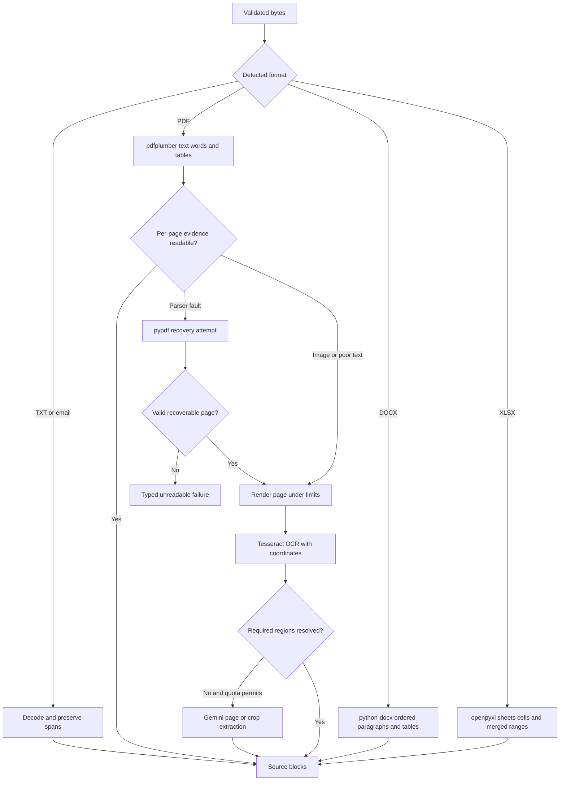

# Document parsing

[Repository overview](../README.md) · [Implementation plan](../IMPLEMENTATION_PLAN.md)

## 1 Parser interface and selection

`Parser.parse(source: ValidatedSource) -> ParsedDocument` returns source blocks, tables, metadata, page diagnostics and typed errors. Persist parser version and content hash. Sniff signatures; extension alone is not authoritative. ZIP containers must be identified as DOCX/XLSX by their OOXML entries.

Use `pdfplumber` for layout-aware digital PDF extraction; it exposes characters, lines, tables and coordinates and works best on machine-generated PDFs. `pypdf` is a recovery/metadata tool, not an OCR engine. [pdfplumber repository](https://github.com/jsvine/pdfplumber).

## 2 Format-specific implementation

| Format | Algorithm | Evidence and recovery |
|---|---|---|
| Email/TXT | UTF-8 BOM handling; safe fallback decoding with a recorded replacement ratio; line and character spans; split fields at known labels rather than every newline | Keep multiline legal names and addresses; high replacement ratio requests review |
| Digital PDF | `extract_words()` with positions; text blocks by geometry; line-based table detection followed by text-aligned fallback; repeated header filtering | Preserve page coordinates and reading order; cross-check explicit totals with container rows |
| Scanned/hybrid PDF | Assess each page independently, render only deficient pages at initial 200 DPI, crop required regions; retry at 300 DPI if necessary | Valid image-only pages enter OCR; malformed/empty/encrypted-unopenable files return typed errors |
| DOCX | Walk document body in XML order across paragraphs and tables; include nested tables, headers, footers; preserve merged-cell semantics | Bilingual labels, party names spanning paragraphs, and image-only embedded content get targeted OCR; no guessed page number |
| XLSX | Inspect all populated sheets; retain coordinates, merged ranges and number formats; read formulas and cached values in separate passes | Ignore stale or absent formula cache as authoritative; never execute macros, external links or arbitrary formulas; explicit review for unresolved formula-derived required values |

For XLSX, cap populated-cell traversal and ignore misleading worksheet `max_row` until dimensions are checked. Use read-only iteration when merged-cell metadata is not required; bounded normal mode can handle small merged sheets. Do not call `str(None)` and treat it as evidence. Hidden sheets/rows may be inspected but flagged as hidden and cannot silently supersede visible instructions. For PDF totals, use the labelled total where present; avoid double-counting both rows and total. Container rows may contain rounded weights, so reconciliation disagreement is an anomaly requiring evidence review rather than automatic replacement of the total.

Observed label aliases to cover include `Shipper/Exporter`, `Shipper (Principal or Seller)`, `To the Order of`, `Notify Party/Intermediate Consignee`, `Load Port`, `Port of Loading (POL)`, `POD`, `No. of Containers or Packages`, `Gross Weight毛重(KGS)` and bilingual DOCX cells. A package label only represents container count if its value/context establishes containers.

## 3 OCR operations and resource limits

Use Tesseract with `eng` and optional `chi_sim` language data for bilingual evidence; retain engine/version/language metadata. Its repository provides the engine and supported integrations. [Tesseract](https://github.com/tesseract-ocr/tesseract).

Apply orientation correction, grayscale, conservative deskew, contrast adjustment, then compare original and thresholded variants only for poor regions. Keep the original image; aggressive denoising can erase digits. Use PDFium or Poppler rendering in a subprocess; impose one OCR page at a time, 20 megapixels maximum decoded page, 30 seconds per parse/OCR attempt, and 20 pages per upload by default. Process chunks and release raster buffers immediately. Tune limits after measuring peak RSS on Railway's memory allowance; if OCR cannot fit, queue for an explicitly configured local worker or use supported Gemini vision within free quota.

Per-page heuristics include printable character ratio, replacement-character ratio, words in labelled regions, and correspondence between text and visible image. A short but valid document must not be rejected solely for having fewer than a fixed number of characters. Record `empty`, `encrypted`, `corrupt`, `unsupported`, `limit_exceeded`, and `ocr_incomplete` separately. Only use `unreadable` in final business output after supported recovery is exhausted.
