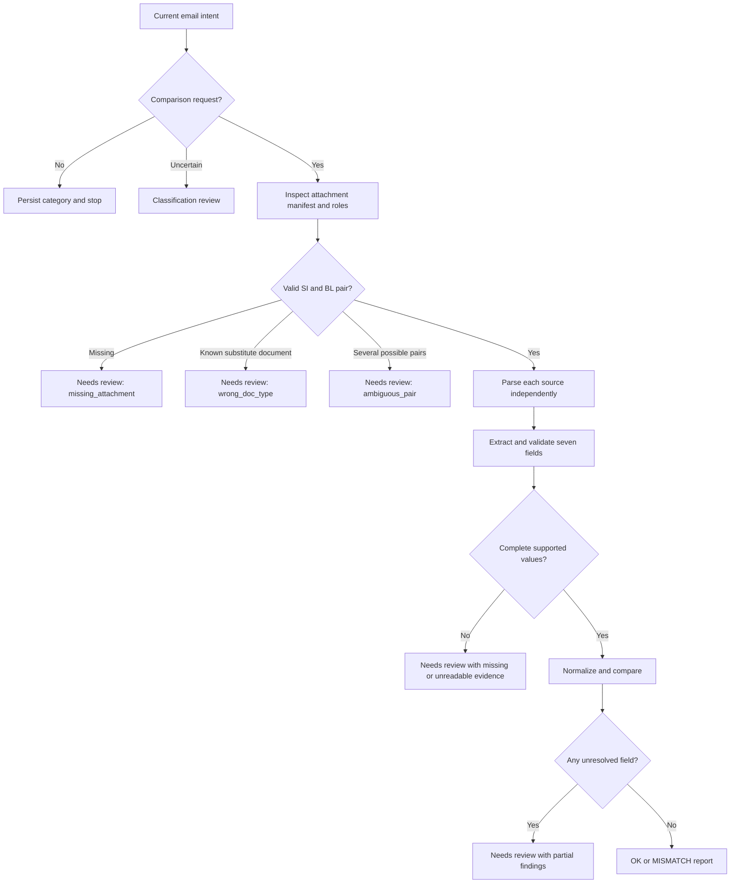

# Processing pipeline

[Repository overview](../README.md) · [Implementation plan](../IMPLEMENTATION_PLAN.md)

## 1 Ingestion and classification

Accept dataset JSON records with `email_id`, `from`, `subject`, `body`, and attachment paths. Import local files through a trusted CLI; the browser submits email text and uploaded attachment IDs, never local disk paths. Preserve the original body and create a second segmented representation: current message, signature, quoted history, and warning banners. Quoted shipment instructions remain searchable but do not override the latest author's intent.

| UI label | Canonical category | Routing |
|---|---|---|
| Document Comparison | `BL_COMPARISON` | Discover documents and verify readiness |
| New Shipping Instruction Request | `SI_REQUEST` | Classification result only |
| Invoice Query | `INVOICE_QUERY` | Classification result only |
| General Inquiry | `GENERAL` | Classification result only |
| Spam / Irrelevant | `SPAM` | Classification result only; never follow message links |

Use high-precision rules as signals, not a subject-only classifier. Asking to check/amend/confirm a draft BL supports comparison. Asking to prepare SI supports SI request. A new SI email may contain all seven fields in its body and still must not enter automatic verification. Missing GR, invoice cancellation, THC and D&D billing questions support invoice query. Operational reminders mentioning SI/BL can be general. Attachments named `_BL` or words inside quoted history are insufficient on their own.

Classify uncertain intent with Gemini using subject, current body, a bounded relevant history segment, and attachment manifest. Attachment content classification may supply a short role summary when necessary. Return all five-class scores as optional diagnostics, chosen category, evidence span IDs, and an ambiguity flag. A multi-intent message uses the primary requested action; unresolved comparison intent gets classification review. Classification review does not default to `GENERAL` or trigger arbitrary pairing.

## 2 Document readiness and pairing

For each comparison request, identify SI, BL, and unrelated documents from content titles, labelled fields, references, and sender context. The filename is a weak prior. Commercial Invoice, Packing List and Certificate of Origin must not be accepted as BL merely because they contain party/weight fields.

Extract document-role evidence and optional shipment references (booking, BL number, order/OC reference, revision/date). These are linking metadata, not additional scored fields. Pair within the email first. Require one coherent SI reference and one BL candidate; multiple candidates require matching references and a clear version choice. Never pair only by arrival order. Across-email linking proposes a relationship for confirmation unless unique stable references and explicit amendment context agree. Email body may be an SI source only if explicitly selected or clearly presented as current shipping instructions; record it as a synthetic `EMAIL_BODY` source with its own hash and spans.

## 3 Normalization, validation and routing

Normalize raw values after extraction, retaining originals. Verify each candidate against source blocks before comparing. Required field placeholders include blank, `???`, all underscores, `TBA`, `TBC`, and explicit unknown markers. Preserve `TO ORDER` as meaningful consignee text. Do not treat zero as missing using truthiness checks; zero containers is an invalid numeric value requiring review.

Per attachment: parser → deterministic labelled candidates → schema-constrained AI extraction for uncertain layouts → grounding checks → optional page OCR/vision → normalized immutable extraction. Run SI and BL independently with bounded concurrency so the BL cannot influence extraction of SI values. The verifier receives completed source records, not a freeform concatenated email.

Route to review when document type is wrong, source is absent/corrupt, evidence is insufficient, one of seven fields is unresolved, sources contradict within a document, pair selection is ambiguous, or confidence gates fail. Preserve any confirmed discrepancies as partial findings, but do not show a completed seven-field clearance. Prioritize high-severity contradictions over routine missing attachments in the queue.

## 4 Completion behavior

`OK` renders **No mismatch detected.** only when all seven fields are complete and match under approved rules. `MISMATCH` requires complete comparable inputs and at least one confirmed mismatch. `NEEDS_REVIEW` explains what blocks the decision, links evidence, and offers the relevant action: select pair, replace file, enter supported value, confirm interpretation, or retry. Non-comparison categories show `NOT_APPLICABLE` internally. Harness export maps that state to the template's `OK` without implying a shipment check occurred.
