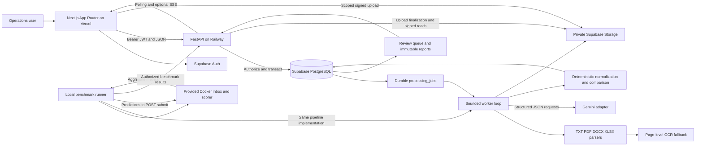
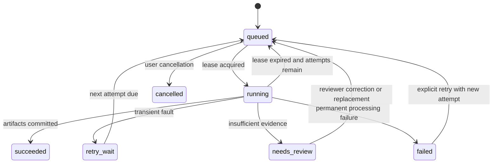
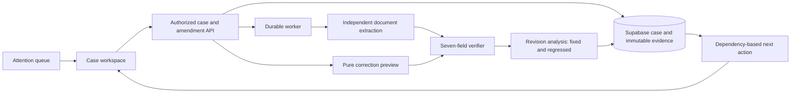

# System architecture and source findings

[Repository overview](../README.md) · [Implementation plan](../IMPLEMENTATION_PLAN.md)

## 1 Source findings and implementation consequences

| Inspected source | Finding | Required implementation consequence |
|---|---|---|
| `Shipping Document Verification Use Case.pdf`, all four pages | Five email categories; only comparison requests proceed; SI is authoritative; seven fields; uncertainty and failure require visible escalation | Separate classification, document readiness, comparison, and review states |
| `Averis x Monash Hackathon Rules and Regulations.docx`, including embedded rubric charts | AI and cloud integration required; original work required; freely chosen stack; publicly accessible functioning prototype required | Meaningful AI classification/extraction, cloud persistence, reproducible deployment, attributable references |
| `sdoc-hackathon-bundle.zip` | Participant-facing inputs and loader; sample submission is a template, not labels | Ingest only inbox and attachment inputs; produce predictions for every email |
| `sdoc-hackathon-docker.zip`: `data_v2/` | 520 emails; 250 attachment files: 192 TXT, 28 PDF, 22 XLSX, 8 DOCX | Format-aware ingestion and evaluation slices; do not assume plain text |
| Full inbox inventory | 394 emails have zero attachments, 124 have two, 2 have one | Attachment absence cannot determine category; pair readiness is a separate decision |
| Attachment parsing audit | 2 malformed PDFs fail parsing; 6 PDFs have no extracted text and form 3 scanned pairs | Distinguish corrupt files from valid image-only documents; OCR the latter |
| Participant-versus-Docker comparison | Inbox and attachment bytes match between distributions | One input manifest can identify this supplied dataset; compute hashes rather than trust names |
| `server/app.py`, `scoring.py`, `loader.py`, Docker configuration | Public inbox/download endpoints; `/submit` accepts an email-ID-keyed object; scoring weights 0.30/0.20/0.50 | Dedicated harness adapter; no guessed evaluation contract |
| `data_v2/README.md` | Documents annotation conventions that conflict with operational completeness in some cases | Preserve truthful product decisions and document benchmark limitations in [Benchmarking](BENCHMARKING.md) |

All 520 inbox JSON records were loaded and all 250 attachments were submitted to their corresponding text/table parsers for this analysis. PDF pages in the problem statement, rubric images, and a representative scan were visually inspected. This is a structural/content audit, not a completed OCR accuracy evaluation. The organizer archive contains a private answer-key file; its contents were not read or used to derive this plan. Keep that file accessible only to the supplied scoring process. Dataset generators are context for fixture design, never runtime predictors or a source of per-email answers.

The DOCX links to expanded preliminary and final Google Docs rubrics; those links were inaccessible during review. The embedded charts are the basis for the following weights, with no invented subcriteria:

| Preliminary criterion | Points | Engineering evidence |
|---|---:|---|
| Working Core Prototype | 25 | Persisted input-to-report flow for every supported format |
| System Design & Architecture | 15 | Typed boundaries, job recovery, isolation, deployment configuration |
| Technology Integration | 15 | Gemini, Supabase, FastAPI and Next.js genuinely connected |
| Technical Feasibility & Validation | 15 | Contract tests, benchmark adapter, failure injection |
| Problem Statement Understanding | 10 | Correct classification and SI reference semantics |
| Innovation & Solution Approach | 10 | Evidence navigation, fallback routing, shipment/version linking |
| Practical Value & Potential | 10 | Correction workflow and reusable verification history |

Final rubric: End-to-End Functionality 25; Architecture & Scalability 15; Technology Integration 15; Engineering Quality & Robustness 15; Solution Effectiveness & Value 10; User Experience & Differentiation 10; Impact & Future Potential 10. These are human judging dimensions, distinct from the Docker score.

## 2 Architecture

**Deployment baseline:** one Railway container hosts one Uvicorn process and one supervised async worker loop initialized by FastAPI lifespan. Jobs and checkpoints live in PostgreSQL, not Python memory. Parser/OCR execution runs in a bounded subprocess with time and memory limits. This minimizes free-tier service overhead. A separate worker process/service can use the identical claim protocol when resources permit. No Redis, paid vector database, or always-running multi-agent supervisor is required.

**Free-cost boundary:** the stack can support a limited free prototype, but cannot honestly guarantee perpetual, always-on production service for zero cost. Railway currently lists a Free plan with $1 monthly credit and a 0.5 GB per-service RAM limit. Stop expensive work when credits/quotas are unavailable; persist queued jobs and provide local execution of the same worker. Do not silently upgrade plans. [Railway plans](https://docs.railway.com/pricing/plans).

## 3 Service boundaries and invariants

| Boundary | Owns | Does not own |
|---|---|---|
| API | JWT verification, workspace membership, validation, idempotency, transactions, job scheduling | CPU-heavy parsing or long provider waits in request handlers |
| Parser registry | Immutable source blocks, page/cell/table locations, parser diagnostics | Choosing shipment truth or deciding defects |
| AI adapter | Classification, document role recognition, candidate field extraction, bounded ambiguity assessment | Database access, arbitrary tools, final numeric comparison |
| Normalizer | Versioned aliases, decimal arithmetic, missing-value semantics | Inventing missing values or rewriting source evidence |
| Verifier | Seven field decisions, report completeness, severity, provenance | Sending emails or approving shipment release |
| Reviewer service | Authorized corrections, optimistic concurrency, new report revision | Destructive edits to original files or AI outputs |
| Benchmark runner | Dataset manifest, pipeline configuration, prediction export, aggregate scores | Access to hidden labels from the application |

Invariants: every child entity belongs to the same workspace as its parent; report inputs identify exact extraction revisions; no report is `OK` with missing or ambiguous required fields; no client-supplied confidence is trusted; evidence cannot cite another attachment; every mutation records actor and request ID.

## 4 File and processing lifecycle

1. Reserve an attachment ID and UUID-based object key under `workspace_id/email_id/attachment_id/original.ext`.
2. Issue a short-lived signed upload for that exact key. Upload privately, then finalize by verifying byte count, hash, MIME signature, membership, and content limits.
3. Move logical state from `pending` to `validated` or `quarantined`. A Storage upload alone never starts parsing.
4. Store immutable originals; generate private derived text, page previews, and OCR artifacts under the attachment ID and parser version.
5. Persist extraction and comparison revisions. Use content hashes plus software/prompt versions for cache identity.
6. Delete temporary local files in `finally`; a janitor removes abandoned upload reservations and unattached objects after 24 hours. Derived preview retention defaults to 7 days; original retention defaults to 30 days for the prototype, configurable per workspace. Retention purges include Storage objects, cached text and provider files, not only DB rows.

Business status (`OK`, `MISMATCH`, `NEEDS_REVIEW`, `NOT_APPLICABLE`) is separate from job status. A provider outage is `retry_wait`/`failed`, never a guessed document outcome. Every stage writes its output and next job in one transaction. Leases and idempotent commits provide at-least-once processing without duplicate reports.

## Amendment workspace extension

The revised operator workflow is authoritative in [Product specification](PRODUCT_SPECIFICATION.md) and [UX specification](UX_SPECIFICATION.md). Introduce a case service above immutable reports: it pins SI/BL/policy versions, maintains issue state, plans the next action and owns optimistic case versions. The verifier remains the single seven-field comparison authority.

Preview computation has no authority to mutate source documents or current verification results. New drafts always run complete verification and old/new analysis against the same pinned SI/policy. Source or policy changes invalidate previews atomically. A stale worker may store a historical result but cannot overwrite a newer case projection.
